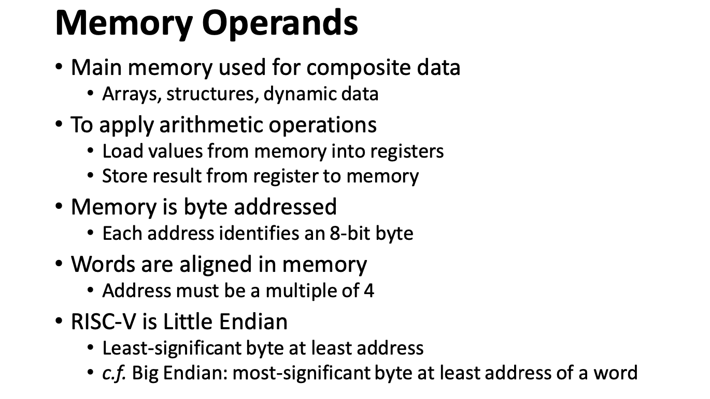

## 1 硬件部分

>[!warning] 必考考点
>- 不同 ISA 架构下的指令实现：Stack, Accumulator, Register-Memory, Register-Register
>- 4 种寻址模式以及对应表现形式
>- 注意点：在 i 型指令中，没有减法指令，使用负数
>- 流水线特性与概念；流水线本质上提升性能是从什么角度？
> 从整体的角度提高整个流水线的 **吞吐量**
> 要会计算几个标准的性能指标：**TP, SpeeUp, Efficiency** 最简单的方式，把三个公式全抄下来（）但要搞清楚物理量是什么
> 给一张表，流水线 CPU 的时钟周期如何确定？
> 画图：流水线 Diagram 以及某一个 Clock的指令运行阶段
> - 流水线的几个基本控制信号（7 个左右）
> - nop 是如何实现的（实际上不存在）
> - Forwarding 在各个阶段的相关接线
> - 非线性流水线（肯定会考，我估计是大题）
> 冲突向量 Conflict Vector，预约表 Reservation Table，状态图 State transition graph，调度方式 Circular Queue，最短平均启动距离 Shortest average interval
>


### 1.1 不同 ISA 架构下的指令实现

#### 1.1.1 Architectures


- Stack Architecture
- Accumulator Architecture
- Register-Memory Architecture

> [!Note] e.g. D = A \* B - (A + C \* B)


##### 1.1.1.1 **Stack** Architecture 

- **Implicit Operands** : on the Top Of the Stack (TOS)
- Simple example: 98 * (12 + 45) 

```assembly
PUSH 98
PUSH 12
PUSH 45
ADD
MUL
```

```assembly
push A
push B
mul
push A
push C
push B
mul
add
sub
pop  D
```

##### 1.1.1.2 Accumulator Architecture

- **One implicit operand**: the accumulator 
- **One explicit operand**: mem location
- Accumulator is both an **implicit input** operand and a **result**

```arm-asm
load  B
mul   C
add   A
store D
load  A
mul   B
sub   D
store D
```

##### 1.1.1.3 Register-Memory Architectures

```arm-asm
load  R1, A
mul   R1, B
load  R2, C
mul   R2, B
add   R2, A
store R2, D
sub   R1, D
store R1, D
```

##### 1.1.1.4 Register Operands


Memory Operand Examples


#### 1.1.2 指令格式

一般情况下不用去记、、也会给出来的

#### 1.1.3 种寻址模式以及对应表现形式


1. 立即数寻址
2. 寄存器寻址
3. 基地址寻址，和内存寻址更相关
4. PC 相关寻址
- PC 相关指令PC+4 是因为一般以 word(32bits) 的形式进行存储

#### 1.1.4 内存运算



- 大端序，小端序

#### 1.1.5 立即数操作

> [!Note] 在 i 型指令中，没有减法指令，使用负数


### 1.2 PipeLine 流水线

#### 1.2.1 流水线的概念

涉及到哪些特性，流水线的相关概念和特性是什么

- Stage / Segment
- Depth


应用场景和损耗计算（头尾时间）


#### 1.2.2 流水线分类

- 单功能流水线 / 多功能流水线
	- 静态流水线
	- 动态流水线


#### 1.2.3 Riscv 特点

- 每条指令都是 32 位
- 格式相对规整
- 寻址方式分类
- 有对齐过程


#### 1.2.4 流水线性能

> [!note] 考点：
> 流水线本质上提升性能是从什么角度？
> 从整体的角度提高整个流水线的 **吞吐量**
> 要会计算几个标准的性能指标：最简单的方式，把三个公式全抄下来（）但要搞清楚物理量是什么
> 给一张表，流水线 CPU 的时钟周期如何确定？


##### 1.2.4.1 时钟周期计算


##### 1.2.4.2 吞吐量计算 TP：不能不写单位 e.g. 1/ps


##### 1.2.4.3 加速比 SpeedUp


##### 1.2.4.4 Efficiency


#### 1.2.5 Diagram


#### 1.2.6 控制器：

> [!note] 考点：
> 7个 **基本控制信号**（多/少 写出核心的）


#### 1.2.7 冲突

在现代处理器设计上，控制冲突是核心部分。因为数据冒险都是可预测的，但控制冒险很难解决


##### 1.2.7.1 HowToStall

改成 Nop（伪指令，实际上不存在，但..:）可以 **考选择题**


##### 1.2.7.2 数据冲突

大部分情况下是写后读 **RAW** 冲突

需不需要 Forwarding

EX冲突：写数据在EX阶段产生
MEM冲突：一般为Load指令，在访问内存之后产生


> [!note] 考点：相关接线


#### 1.2.8 非线性流水线

> [!note] 相关概念:
> 冲突向量 Conflict Vector，预约表 Reservation Table，状态图 State transition graph，调度方式 Circular Queue，最短平均启动距离 Shortest average interval


> 以下非线性流水线搬运自 tonycrane.cc orz

- 线性流水线逐个运行每一个阶段，每一个阶段都会运行且仅运行一次，没有反馈和前馈
- 非线性流水线存在反馈和前馈连接，其一个阶段（部件）可能使用一次或多次
- 非线性流水线仅通过连接图不能够确定流水线的运行顺序，一个连接图可能对应多个不同的运行顺序
- 非线性流水线的运行需要通过预约表（reservation table）来表示
    - 每一行表示一个阶段，每一列表示一个时钟周期
    - 整个表表示一个任务的运行流程，如果在某个周期运行某一阶段，则在对应位置打上 X
    - 线性流水线也有预约表，不过都是固定的，为一个正方形表格，对角线上都是 X

如下图就是一个非线性流水线的连接图，和它的一个预约表：


| |1|2|3|4|5|6|7|
|:--:|:--:|:--:|:--:|:--:|:--:|:--:|:--:|
|S1|X| | |X| | |X|
|S2| |X| | |X| | |
|S3| |X| | | |X| |
|S4| | |X| | | | |

- 非线性流水线不能像线性流水线一样直接逐个任务贴在一起依次运行，因为会出现冲突（同一周期不同任务使用同一阶段，即结构冒险）
- 非线形流水线需要通过调度算法来找到最优的任务启动方式，使得任务间不会产生冲突，而且运行最高效
- 第一个任务进入流水线后，第二个任务进入且不发生冲突的时间称为启动距离。在同一个调度方式中启动距离可能不同，最佳的调度方式是使平均启动距离最短

##### 1.2.8.1 非线性流水线调度算法

两个概念：

- 禁止集合（prohibit sets），指预约表中每一行任意两个 X 之间的距离构成的集合。意义为：两个任务之间的间隔不能是这个集合中的任意一个值
- 冲突向量（conflict vector），表示为 $(C_m, C_{m-1}, \cdots, C_2, C_1)$，其中 $m$ 为禁止集合中的最大值，如果 $i$ 在禁止集合中，则 $C_i=1$ 否则 $C_i=0$

对于上面的预约表，禁止集合为 $F=\{3, 4, 6\}$，初始冲突向量为 $C=\mathtt{101100}$。

因此参考于初始冲突向量，下一个任务只可能在后第 1、2、5、7 个周期进入（右数 1、2、5 位为 0，7 为总长度加一，相当于硬等一个任务的时常）。以后第一个周期进入为例。第二个任务的初始冲突向量也为 $C=\mathtt{101100}$，此时第一个任务经过了一个周期，冲突向量右移一位变为 $C=\mathtt{10110}$。接着再考虑加入第三个任务，这个任务不能和 1、2 两个冲突，所以此时整体的冲突向量应该是前两个任务此时的冲突向量按位求或，即 $\mathtt{101100} | \mathtt{10110} = \mathtt{111110}$。所以第三个任务只能在后一个周期进入。

这样依此类推，最终不再计算下去的条件为：冲突向量变为了全 1，只能等待一个任务的时长回到初始状态；或者得到的冲突向量和之前的某个相同（达成了循环）。最终可以画出一个状态图。

对于上面的例子，它的状态图如下（方块内为冲突向量，箭头上为等待几个周期进入，即启动距离）：

**State transition graph**


所以它的几种调度方式（用启动距离表示）和平均启动距离为：
<div style="text-align: center" markdown="1">

|调度方式Circular queue |平均启动距离 Shortest average interval |
|:--|:--:|
|7|7|
|1, 7|4|
|1, 1, 7|3|
|2, 7|4.5|
|2, 5|3.5|
|2, 5, 7|4.67|
|5|5|
|5, 2|3.5|
|5, 7|6|

所以最短平均启动距离为 3，对应的调度方式为 1、1、7。


> [!warning] 
> 接下来的考点比较零碎，不会出大题

#### 1.2.9 并行运行/多发射

 

记住区别


