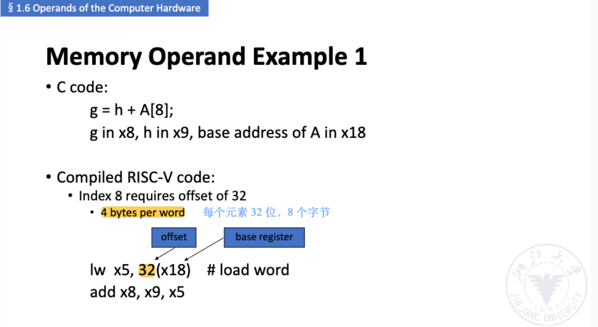

slide: ![[../slides/lec01-1(1).pdf]]

----

```slide-note
file: lec01-1(1).pdf
page: 5
scale: 1
dpi: 2
text: true
```

----

```slide-note
file: [[lec01-1(1).pdf]]
page: 8
scale: 1
dpi: 2
text: true
```


> [!Note] with **attendence** as bonus

## 1 Instruction Set Principles

### 1.1 Architectures


- Stack Architecture
- Accumulator Architecture
- Register-Memory Architecture

> [!Note] e.g. D = A \* B - (A + C \* B)


#### 1.1.1 **Stack** Architecture 

- **Implicit Operands** : on the Top Of the Stack (TOS)
- Simple example: 98 * (12 + 45) 

```assembly
PUSH 98
PUSH 12
PUSH 45
ADD
MUL
```

```assembly
push A
push B
mul
push A
push C
push B
mul
add
sub
pop  D
```

#### 1.1.2 Accumulator Architecture

- **One implicit operand**: the accumulator 
- **One explicit operand**: mem location
- Accumulator is both an **implicit input** operand and a **result**

```arm-asm
load  B
mul   C
add   A
store D
load  A
mul   B
sub   D
store D
```

#### 1.1.3 Register-Memory Architectures

```arm-asm
load  R1, A
mul   R1, B
load  R2, C
mul   R2, B
add   R2, A
store R2, D
sub   R1, D
store R1, D
```

#### 1.1.4 Register Operands


Memory Operand Examples




#### 1.1.5 Caller Saving and Callee Saving P484


叶子过程示例


