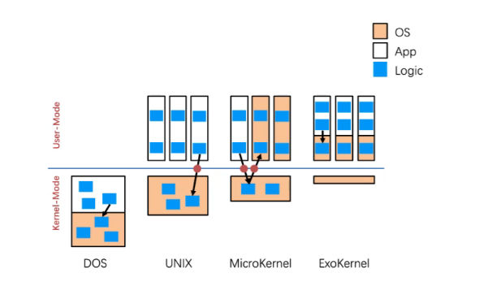

# cs

[toc]

## 3 general methods to pass parameters to the os

* register

## MS-DOS

## monolithic structure

### orginal unix

* systems programs
  
### microkernel system structure

* benefits

### exokernel(外内核)

motivation

### fork

* 系统调用，创建子进程。a way to create a new process
* 调用一次返回两次(父进程一次，子进程一次)

### wait

父进程等待子进程的完成

### exec

### process

* the program code(text section)
* runtime CPU states(program counter,)
* 