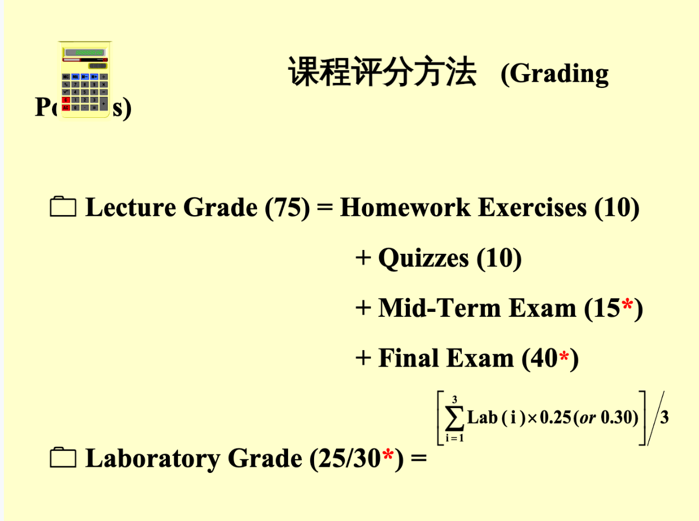

## Course Grade

Lecture grade = Homework Exercise (10) + Quizzes (10) + Mid-Term Exam (15\*) + Final Exam (45\*)

Laboratory Grade (25*) =  $[\Sigma_{i=1}^3Lab(i)\times0.25] / 3$ 

```slide-note
file: DS00(1).pdf
page: 4
dpi:2
```



### Quizzes

```slide-note
file: DS00(1).pdf
page: 6
dpi:2
```

