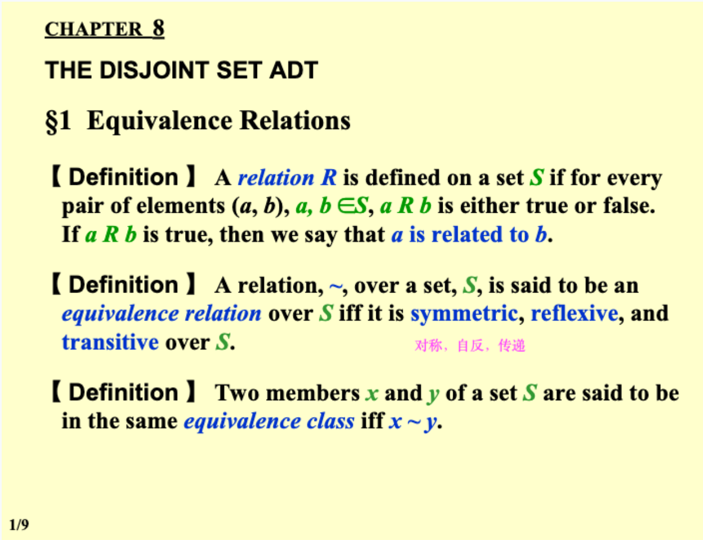
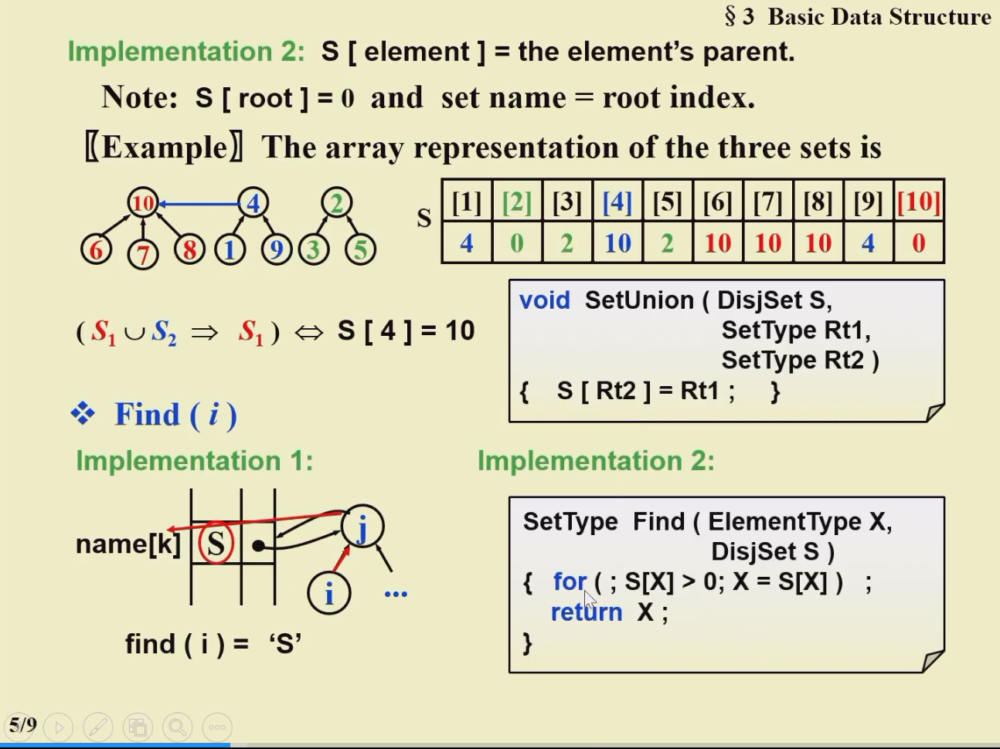

一般情况下，对于Queue而言，最核心的操作是：**插入队列( enqueue )、移出队列( dequeue )**。 因为在队列中，插入操作是插入到队列的最后，而移出操作是移出队列的头部元素。

## Lists, Stacks, and Queues

## Abstract Data Type (ADT)

### Lists

Objects: ( $item_0$, $item_1$, ××× , $item_{N-1}$ )

Operations:

- Finding the length, N, of a list.
- Printing all the items in a list.
- Making an empty list.
- Finding the k-th item from a list, $0 \leqslant k < N$.
- Inserting a new item after the k-th item of a list, $0 \leqslant k < N$.
- Deleting an item from a list.
-  Finding next of the current item from a list.
-  Finding previous of the current item from a list.

#### 1. Simple Array Implementation of Lists 数组实现

 - MaxSize has to be estimated.
 - Find Kth takes O(1) time.
- Insertion and Deletion not only take O(N) time, but also involve a lot of data movements which takes time.

#### 2. Linked List 链表实现

> dummy head node

实现多项式：

```c
typedef struct poly_node *poly_ptr
struct poly_node {
	int Coefficient; // assume coefficient are integers
	int Exponent;
	poly_ptr Next;
};
typedef poly_ptr a; // node sorted by exponent
```

学生选课：Sparse matrix 稀疏矩阵的实现


## 二叉树


### 遍历方法

#### PreOrder

访问顺序：先访问根节点，上左右

```c
void PreOrder(Tree T) {
	if (T != NULL) {
	printf("%d", T->value);
	PreOrder(T->Left);
	PreOrder(T->Right);
	}
}
```

#### InOrder

访问顺序：根节点在中间访问，左上右

```c
void InOrder(Tree T) {
	if (T != NULL) {
	InOrder(T->Left);
	printf("%d", T->value);
	InOrder(T->Right);
	}
}
```

#### PostOrder

访问顺序：先访问叶节点，左右上

```c
void PostOrder(Tree T) {
	if (T != NULL) {
	PostOrder(T->Left);
	PostOrder(T->Right);
	printf("%d", T->value);
	}
}
```

### 判断树的同构

两棵树 T1，T2，T1 可以通过若干次孩子互换变成 T2 则同构：通过交换 T->Left 和 T->Right

```c
int Isomorphic( Tree T1, Tree T2 ) {
    if (T1 == NULL && T2 == 0) { // T1 and T2 are both null
        return 1;
    } else if ((T1 == NULL && T2 != NULL) || (T1 != NULL && T2 == NULL)) { // one of T1 and T2 is null
        return 0;
    } else if (T1->Element != T2->Element) { // the value is different
        return 0;
    } else {
        return (Isomorphic(T1->Left, T2->Left) && Isomorphic(T1->Right, T2->Right)) || (Isomorphic(T1->Left, T2->Right) && Isomorphic(T1->Right, T2->Left));
    }
}
```

### 树的构建

根据中序遍历（inorder）和后序遍历（postorder）的输出构建二叉树

- 对于中序遍历，根节点的左子树位于根节点的左侧，右子树位于根节点的右侧。
- 对于后序遍历，根节点位于序列的最后一个元素，左子树位于根节点的左侧，右子树位于根节点的右侧。

1. 从后序遍历的最后一个元素中获取根节点的值。
2. 在中序遍历中找到根节点的位置，将其分为左子树的中序遍历序列和右子树的中序遍历序列。
3. 根据左子树中序遍历序列的长度，将后序遍历序列分为左子树的后序遍历序列和右子树的后序遍历序列。
4. 递归地对左子树和右子树进行相同的操作，构建左子树和右子树。
5. 将根节点、左子树和右子树连接起来，构建完整的二叉树。

### 树节点的计算

Given a tree of degree 3. Suppose that there are 3 nodes of degree 2 and 2 nodes of degree 3. Then the number of leaf nodes must be *8*.

- degree: 一个节点最多有几个子节点
- 二叉树的性质：叶结点个数等于度为2的结点个数加1
- 所有节点的个数 $sum = 1\times n_1 +$
- general tree 转成 binary tree：
	- 有同一个根节点
	- 对于一个节点，二叉树的左孩子=普通树的最左孩子
	- 对于一个节点，二叉树的右孩子=该节点的右边相邻节点


### 树的分类

 1. Skewed Binary Tree 倾斜二叉树
 2. Complete Binary Tree 完全二叉树

- Perfect Tree: 完美二叉树（满二叉树）： all leaf nodes at the same depth
- Complete Tree: 完全二叉树：从根结点到倒数第二层满足完美二叉树，最后一层可以不完全填充，其叶子结点都靠左对齐。
- Full Tree: 完满二叉树：所有非叶子节点的度都是二（只要你有孩子，你就必然是有两个孩子）

完全二叉树（Complete Binary Tree）是一种特殊的二叉树。在完全二叉树中，所有的层级（除了可能的最后一层）都被完全填满，并且所有节点都尽可能地向左集中。

具体定义如下：

1. 除了最后一层之外，其他每一层的节点数都达到最大。
2. 最后一层的节点都靠左排列。

例如，考虑一个高度为 h 的二叉树：

1. 如果 h-1 层（即除最后一层外的所有层）都被完全填满，并且最后一层的所有节点都**连续靠左**，则这是一个完全二叉树。

完全二叉树的特点是它可以使用数组连续地、不浪费空间地存储其节点，这就是为什么很多堆的实现都选择使用数组来存储的原因。

需要注意的是，满二叉树（每一层都被完全填满的二叉树）肯定是一个完全二叉树，但一个完全二叉树不一定是满二叉树。

##  二叉搜索树

#### Definition

> A binary search tree is a binary tree. It may be empty. If it is not empty, it satisfies the following properties: 

(1) Every node has a key which is an **integer**, and the keys are **distinct**. 
(2) The keys in a nonempty **left** subtree must be **smalle**r than the key in the root of the subtree. 
(3) The keys in a nonempty **right** subtree must be **larger** than the key in the root of the subtree. 
(4) The left and right subtrees are also binary search trees.

### ADT

```c
Search Tree MakeEmpty(SearchTree T);
Position Find(ElementType X, SearchTree T);
Position FindMin(SearchTree T);
Position FindMax(SearchTree T);
SearchTree Insert(ElementType X, SearchTree T);
SearchTree Delete(ElementType X, SearchTree T);
ElementType Retrieve(Position P);
```

### Implementations

#### Find

> Recursive Version: T(N) = S(N) = O(d)

```c
Position Find(ElementType X, SearchTree T) {
	if (T == NULL) {
		return NULL;
	}
	if (X < T->Element) {
		return Find(X, T->Left);
	} else if (X > T->Element) {
		return Find(X, T->Right);
	} else {
		return T;
	}
}
```

> Iterative Version

```c
Position Find(ElementType X, SearchTree T) {
	while (T) {
		if (X == T->Element) {
			return T;
		} else if (X < T->Element) {
			T = T->Left;
		} else {
			T = T->Right;
		}
	}
	return NULL;
}
```

#### Insert

```c
SearchTree Insert(ElementType X, SearchTree T) {
	if (T == NULL) { /* Create and return a one-node tree */
		T = malloc(sizeof(struct TreeNode));
		if (T == NULL) {
			FatalError("Out of space!!!");
		} else {
			T->Element = X;
			T->Left = T->Right = NULL;
		}/* End creating a one-node tree */
	} else {
		if (X < T->Element) {
			T->Left = Insert(X, T->Left);
		} else if (X > T->Element) {
			T->Right = Insert(X, T->Right);
		}
	}
	return T;
}
```

1. 首先，检查当前的搜索树 `T` 是否为空。如果是空树，表示还没有任何节点，需要创建并返回一个只包含一个节点的树。
    - 在这种情况下，通过动态内存分配使用 `malloc` 创建一个新的节点，并分配内存空间。
    - 如果分配内存失败，则抛出致命错误。
    - 如果成功分配内存，则将节点的元素值设置为 `X`，并将左右子树指针都设为 `NULL`，表示该节点没有左右子树。

2. 如果当前的搜索树 `T` 不为空，则比较要插入的元素 `X` 与当前节点的元素值 `T->Element` 的大小关系，以确定插入位置。
    - 如果 `X` 小于当前节点的元素值 `T->Element`，则将元素插入到当前节点的左子树。
        - 调用递归函数 `Insert(X, T->Left)` 将 `X` 插入到当前节点的左子树中。
        - 递归调用确保了在左子树中继续寻找合适的插入位置。
    - 如果 `X` 大于当前节点的元素值 `T->Element`，则将元素插入到当前节点的右子树。
        - 调用递归函数 `Insert(X, T->Right)` 将 `X` 插入到当前节点的右子树中。
        - 递归调用确保了在右子树中继续寻找合适的插入位置。

#### Delete

- 删除叶节点：Reset its parent link to NULL
- T( N) = O ( h ) where h is the height of the tree

```c
SearchTree Delete(ElementType X, SearchTree T) {
    Position TmpCell;
    if (T == NULL) {
        Error("Element not found");
        return NULL;
    }
    if (X < T->Element) {
        T->Left = Delete(X, T->Left);
    } 
    else if (X > T->Element) {
        T->Right = Delete(X, T->Right);
    } 
    // Element found and has two children.
    else if (T->Left != NULL && T->Right != NULL) {
        TmpCell = FindMin(T->Right);
        T->Element = TmpCell->Element;
        T->Right = Delete(T->Element, T->Right);
    } 
    else { // Element found with one or no child.
        TmpCell = T;
        if (T->Left == NULL) {
            T = T->Right;
        } else if (T->Right == NULL) {
            T = T->Left;
        }

        free(TmpCell);
    }

    return T;
}
```

**找到要删除的元素**:
    
 a. **当前节点有两个子节点**:
    - 我们找到右子树中的最小元素（它会成为删除后的新节点）。
    - 将当前节点的元素替换为右子树中的最小元素。
    - 递归地在右子树中删除这个最小元素。

b. **当前节点只有一个子节点或没有子节点**:
    - 如果当前节点只有右子节点或没有子节点，我们将 `T->Right` 赋给 `T`。
    - 如果当前节点只有左子节点，我们将 `T->Left` 赋给 `T`。
    - 在这两种情况下，我们最后释放 `TmpCell`，也就是原始的 `T` 节点。

> [!Note] 删除的时候可以用左树的最大或者右树的最小来代替


### 红黑树 Red-Black Tree

1. 函数首先检查是否到达了叶子节点（在红黑树中，叶子通常是指代NULL的哨兵节点），如果是，因为按照定义，每个叶子都是黑色的，所以返回1。
2. 然后，函数递归地计算左子树和右子树的“黑高”（即从当前节点到叶子节点的路径上的黑色节点数），并检查这两个高度是否相等。不相等，或任一子树的路径不满足红黑树性质（通过返回-1表示），则当前树不满足红黑树的性质5，返回-1。
3. 如果当前节点是黑色的，那么在返回的黑高度上加1，因为要包含当前节点。
    
4. 最后，`Property5`函数检查根节点开始的整棵树是否满足性质5。如果`blackHeight`函数在任何点返回-1，整棵树就不满足条件；否则，它确实满足。

### ADT Model: 优先队列

#### Operations：

- `PriorityQueue Iitialize(int MaxElements);`
- `void Insert(ElementType X, PriorityQueue H)`
- `ElementType DeleteMin(PriorityQueue H)` **用的最多**
- `ElementType FindMin(PriorityQueue H)`

## Binary HEAP

#### Structure Property: 

【Definition】A binary tree with n nodes and height h is complete if its nodes correspond to the nodes numbered from 1 to n in the perfect binary tree of height h.

- Perfect Tree: 完美二叉树（满二叉树）： all leaf nodes at the same depth
- Complete Tree: 完全二叉树：从根结点到倒数第二层满足完美二叉树，最后一层可以不完全填充，其叶子结点都靠左对齐。
- Full Tree: 完满二叉树：所有非叶子节点的度都是二（只要你有孩子，你就必然是有两个孩子）

#### HEAP：

二叉堆是一种特殊的堆，二叉堆是完全二元树（二叉树）或者是近似完全二元树（二叉树）。二叉堆有两种：最大堆和最小堆。最大堆：父结点的键值总是大于或等于任何一个子节点的键值；最小堆：父结点的键值总是小于或等于任何一个子节点的键值。

If a complete binary tree with $n$ nodes is represented sequentially, then for any node with index $i$, $1\leq i \leq n$, we have:

- parent noode index: $\frac{i}{2}$
- left child node: $i\times 2$
- right child node: $i\times 2+1$

#### 在 heap 中插入元素

在叶节点插入元素，然后逐渐向上比较互换，找到自己的位置。
代码实现：

```c
void Insert( ElementType X, PriorityQueue H )
{
    int p = ++H->Size;
    H->Elements[p] = X;
    PercolateUp( p, H );
}

void PercolateUp( int p, PriorityQueue H ) {
    if (p == 1) return ;
    int parent = p / 2;
    if (H->Elements[parent] > H->Elements[p]) {
        H->Elements[p]      = H->Elements[p] ^ H->Elements[parent];
        H->Elements[parent] = H->Elements[p] ^ H->Elements[parent];
        H->Elements[p]      = H->Elements[p] ^ H->Elements[parent];
        PercolateUp(parent, H);
    } else {
        return ;
    }
}
```
 
#### 在 heap 中删除元素

用一个叶节点替换，然后逐渐向下比较互换，找到自己的位置，
代码实现：

```C
ElementType DeleteMin( PriorityQueue H )
{
    ElementType MinElement;
    MinElement = H->Elements[1];
    H->Elements[1] = H->Elements[H->Size--];
    PercolateDown( 1, H );
    return MinElement;
}

void i int p, PriorityQueue H ) {
    int left = p * 2;
    int right = p * 2 + 1;
    ir
    if (right > H->Size) {
        right = left;
    }
    if (H->Elements[p] > H->Elements[left]) {
        H->Elements[p]      = H->Elements[p] ^ H->Elements[left];
        H->Elements[left]   = H->Elements[p] ^ H->Elements[left];
        H->Elements[p]      = H->Elements[p] ^ H->Elements[left];
        PercolateDown(left, H);
    } else if (H->Elements[p] > H->Elements[right]) {
        H->Elements[p]      = H->Elements[p] ^ H->Elements[right];
        H->Elements[right]  = H->Elements[p] ^ H->Elements[right];
        H->Elements[p]      = H->Elements[p] ^ H->Elements[right];
        PercolateDown(right, H);
    } else {
        return ;
    }
}
```

### 用数组实现一个完全二叉搜索树的创建

1. 将元素存储在一个数组中，按照从小到大的顺序排列。
2. 确定完全二叉搜索树的层数（高度）。完全二叉树的层数可以通过求解元素数量的对数来确定。例如，如果有 $N$ 个元素，则高度为 $h = ceil(\log_2(N+1))$。
3. 根据高度确定完全二叉搜索树的节点数量。节点数量为 $2^h - 1$，其中 h 是完全二叉搜索树的高度。
4. 创建一个与节点数量相同的数组来表示完全二叉搜索树。
5. 通过递归方式，**按照中序遍历的顺序将元素从原始数组插入到完全二叉搜索树数组中**。具体步骤如下：
    - 找到当前子树的根节点的索引。根节点的索引为 (start + end) / 2，其中 start 是当前子树的起始索引，end 是当前子树的结束索引。
    - 将原始数组中根节点索引位置的元素插入到完全二叉搜索树数组中的根节点位置。
    - 递归地将左子树和右子树的元素插入到完全二叉搜索树数组中。左子树的范围为 (start, rootIndex-1)，右子树的范围为 (rootIndex+1, end)。

```c
void BuildCSBT(int start, int end, int index) {
    if (start > end) {
        return;
    }

    int n = end - start + 1;
    int level = (int)floor(log2(n + 1));
    int leaf = n - (int)pow(2, level) + 1;
    int root_index = (int)pow(2, level - 1) - 1 + fmin(leaf, (int)pow(2, level - 1));

    tree[index - 1] = value[start + root_index];

    BuildCSBT(start, start + root_index - 1, index * 2);
    BuildCSBT(start + root_index + 1, end, index * 2 + 1);
}
```


### 最大堆变最小堆

1. 找到最后一个非叶子节点，从该节点开始，逐个向上处理每个节点。
2. 对于每个节点，执行下沉操作，将其调整到正确的位置以维护最小堆的性质。

给出按照 level traversal 输出的 MaxHeap [82, 65, 17, 26, 8, 12, 3]，将其转化成最小堆的 python 代码实现：

```python
def heapify(arr, n, i):
    smallest = i
    left = 2 * i + 1
    right = 2 * i + 2

    # Check if left child is smaller than root
    if left < n and arr[left] < arr[smallest]:
        smallest = left

    # Check if right child is smaller than smallest so far
    if right < n and arr[right] < arr[smallest]:
        smallest = right

    # If smallest is not root, swap it with root and continue heapifying
    if smallest != i:
        arr[i], arr[smallest] = arr[smallest], arr[i]
        heapify(arr, n, smallest)

def convertMaxToMinHeap(arr):
    n = len(arr)
    # Start from the last non-leaf node and go upward
    for i in range(n // 2 - 1, -1, -1):
        heapify(arr, n, i)
    return arr

# Given max heap
max_heap = [82, 65, 17, 26, 8, 12, 3]

# Convert to min heap
min_heap = convertMaxToMinHeap(max_heap)
print(min_heap)

```


## The Disjoint Set ADT

The Disjoint Set has 2 operations
- connect(x, y): Connects x and y
- isConnected: Returns true if x and y are connected. Connections can be transitive, i.e. they don’t need to be direct.
Rather than manually writing out every single connecting line, only record the sets that each item belongs to.


###  Equivalence Relations 等价关系

```slide-note
file: [[DS07_Ch08-Union-Find.pdf]]
page: 1
```



#### Operations:

- `Union(i, j)`: Replace $S_i$ and $S_j$ by $S = S_i \cup S_j$
- `Find(i)`: Find the set $S_k$ which contains the element $i$

#### Basic Data Structure

#### 一种可能的实现方式：用 Tree 实现

> [!Note] 节点由孩子指向父亲：根节点可以代表这个 Set，比用数组遍历快很多

```slide-note
file: [[DS07_Ch08-Union-Find.pdf]]
page: 4
```

#### 用数组实现

S[element] = the element's parent



#### 3. 优化 union 的方法

##### 3.1 union by size

> Always change the smaller tree

```c
S[Root] = -Size; /* Initialized to be -1 */
```

Let T be a tree created by union-by-size with N nodes, then the height of T can be at most $\log_2N+1$

##### 3.2 union by height

> Always change the shallow tree

p273 for detailed information

#### 4. Path Compression 路径压缩

不用刻意压缩，每次 Find 时压缩即可

递归版本：

```c
SetType Find(ElementType X, DisjSet S) {
	if (S[x] < 0) {
		return X;
	} else {
		return S[X] = Find(S[X], S); 
	}
}
```

迭代版本：

```c
SetType Find( ElementType X, DisjSet S ) {   
   ElementType root, trail, lead;

   for ( root = X; S[root] > 0; root = S[root]);  
   for ( trail = X; trail != root; trail = lead ){
		lead = S[trail];   
		S[trail] = root;   
   } 
   return root;
}
```

#### 5. Worst Case 

