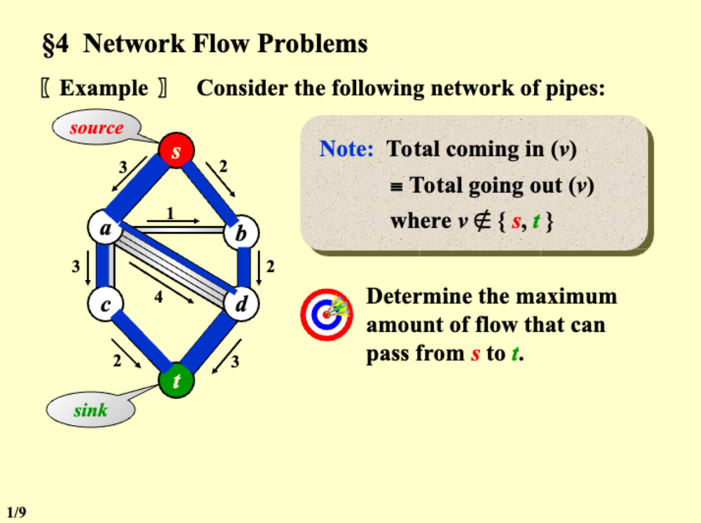
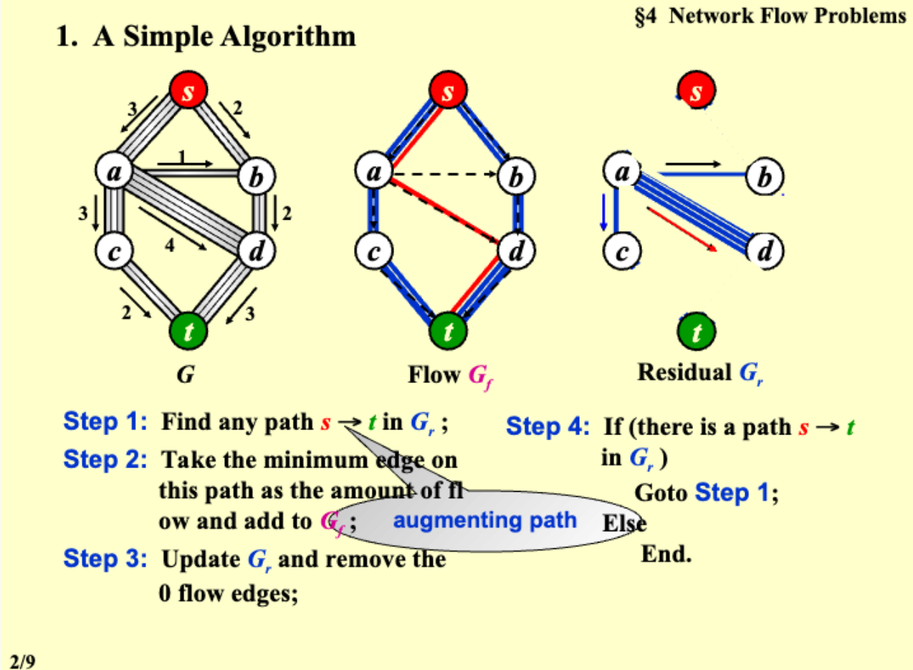
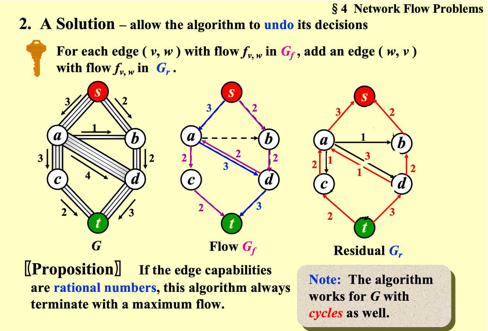
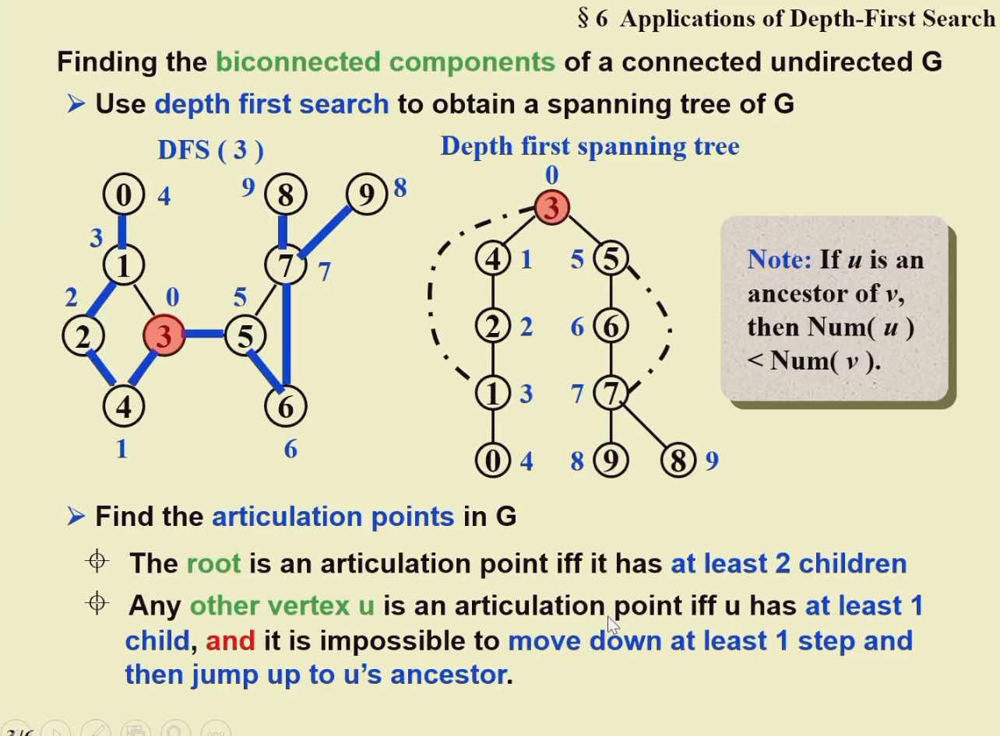

## 图 Graph

![[Pasted image 20231119180831.png]]

```slide-note
file: [[DS08_Ch09-Graph Definition-Topological Sort.pdf]]
page: 1, 2
```

### 邻接矩阵 Adjacency Matrix

### 邻接链表 Adjacency Lists

读图的函数：

```c
typedef int Vertex;     /* vertices are numbered from 0 to MaxVertices-1 */
typedef struct VNode *PtrToVNode;
struct VNode {
    Vertex Vert;
    PtrToVNode Next;
};
typedef struct GNode *Graph;
struct GNode {
    int NumOfVertices;
    int NumOfEdges;
    PtrToVNode *Array;
};

Graph ReadG() {
    Graph G = (Graph)malloc(10000 * sizeof(Vertex));
    scanf("%d %d", &(G->NumOfVertices), &(G->NumOfEdges));
    G->Array = (PtrToVNode *)malloc(G->NumOfVertices * sizeof(PtrToVNode));

    for (int i = 0; i < G->NumOfVertices; i++) {
        G->Array[i] = NULL;
    }

    for (int i = 0; i < G->NumOfEdges; i++) {
        Vertex v1, v2;
        scanf("%d %d", &v1, &v2);
        PtrToVNode newNode = (PtrToVNode)malloc(sizeof(struct VNode));
        newNode->Vert = v2;
        newNode->Next = NULL;

        if (G->Array[v1] == NULL) {
            G->Array[v1] = newNode;
        } else {
            PtrToVNode currentNode = G->Array[v1];
            while (currentNode->Next != NULL) {
                currentNode = currentNode->Next;
            }
            currentNode->Next = newNode;
        }
    }
    return G;
}
```

在每一个 List 里 order doesn't matter

有向图 List

```slide-note
file: [[DS08_Ch09-Graph Definition-Topological Sort.pdf]]
page: 6
```


#### Adjacency MultiList 邻接十字链表

![[adjacencymultilist.png]]

![[Pasted image 20231114134232.png]]

### 最短路径

#### DFS 深度优先搜索

https://zhuanlan.zhihu.com/p/24986203

```cpp
int goal_x = 9, goal_y = 9;     //目标的坐标，暂时设置为右下角
int n = 10 , m = 10;               //地图的宽高，设置为10 * 10的表格
int graph[n][m];        //地图
int used[n][m];         //用来标记地图上那些点是走过的
int px[] = {-1, 0, 1, 0};   //通过px 和 py数组来实现左下右上的移动顺序
int py[] = {0, -1, 0, 1};
int flag = 0;           //是否能达到终点的标志

void DFS(int graph[][], int used[], int x, int y)
{
    // 如果与目标坐标相同，则成功
    if (graph[x][y] == graph[goal_x][goal_y]) {     
        printf("successful");
        flag = 1;
        return ;
    }
    // 遍历四个方向
    for (int i = 0; i != 4; ++i) {    
        //如果没有走过这个格子          
        int new_x = x + px[i], new_y = y + py[i];
        if (new_x >= 0 && new_x < n && new_y >= 0 
            && new_y < m && used[new_x][new_y] == 0 && !flag) {
            
            used[new_x][new_y] = 1;     //将该格子设为走过

            DFS(graph, used, new_x, new_y);      //递归下去

            used[new_x][new_y] = 0;//状态回溯，退回来，将格子设置为未走过
        }
    }
}
```

#### BFS 广度优先搜索

```cpp
int n = 10, m = 10;                   //地图宽高
void BFS()
{
    queue que;              //用队列来保存路口
    int graph[n][m];          //地图
    int px[] = {-1, 0, 1, 0};   //移动方向的数组
    int py[] = {0, -1, 0, 1};
    que.push(起点入队);      //将起点入队
    while (!que.empty()) {    //只要队列不为空
        auto temp = que.pop();          //得到队列中的元素
        for (int i = 0; i != 4; ++i) {
            if(//可以走) {
                //标记当前格子
                //将当前状态入队列，等待下次提取
            }
        }
    } 
}
```

#### unweighted

```c
void Unweighted(Table T) {
	int CurrDist;
	Vertex V, W;
	Q = CreateQueue(MaxSize);
    Enqueue(S, Q);
    while (!IsEmpty(Q)) {
    	V = Dequeue(Q);
    	for each W adjacent to V
    		if (T[W].Dist == Infinity) {
    			T[W].Dist = T[V].Dist + 1;
    			T[W].Path = V;
    			Enqueue(W, Q);
    		}
    }
    DisposeQueue(Q)
}
```

#### Dijkstra algorithm

[Dijstra algrithm Demo in CS61B](https://docs.google.com/presentation/d/1_bw2z1ggUkquPdhl7gwdVBoTaoJmaZdpkV6MoAgxlJc/pub?start=false&loop=false&delayms=3000&slide=id.g771336078_0_1800)

Visit vertices in order of best-known distance from source. On visit, relax every edge from the visited vertex. Dijkstra’s is guaranteed to return a correct result if all edges are **non-negative**. 

伪代码：

```c
void Dijkstra(Table T) {
    Vertex V, W;
    for ( ; ; ) {
        V = smallest unknown distance vertex;
        if (V == NotAVertex) {
            break;
        }
        T[V].Known = True;
        for each W adjacent to V {
            if (T[V].Dist + Cvw < T[W].Dist) {
                Decrease(T[W].Dist to T[V].Dist + Cvw);
                T[W].Path = V;
            }
        }
    }
}
```

![[Pasted image 20231121112009.png]]

判断是否是 Dijkstra 路径：

```c
bool IsDij(int *Seq) {
    int dist[MaxN]; /**< Array to store the shortest distance from the source vertex */
    bool known[MaxN]; /**< Array to track whether a vertex is known or not */

    // Initialize the distance array and known array
    for (int i = 1; i < Nv + 1; i ++) {
        dist[i] = INF; // Initialize the distance of all vertices to infinity
        known[i] = false; // Set all vertices as unknown
    }

    dist[Seq[0]] = 0; // Set the distance of the source vertex to 0

    for (int i = 0; i < Nv; i ++) { // Calculate the distance array
        int min = INF;
        int min_index = -1;

        // Find the unknown vertex with the smallest distance
        for (int j = 1; j < Nv + 1; j ++) {
            if (known[j] == false && dist[j] < min) {
                min = dist[j];
                min_index = j;
            }
        }

        if (min == INF) { // If no vertex is found, it means the remaining vertices are unreachable
            break;
        }

        known[min_index] = true; // Mark the vertex as known

        // Update the distance array
        for (int j = 1; j < Nv + 1; j ++) {
            if (known[j] == false && G[min_index][j] != INF) {
                if (dist[j] > dist[min_index] + G[min_index][j]) {
                    dist[j] = dist[min_index] + G[min_index][j];
                }
            }
        }
    }

    for (int i = 0; i < Nv-1; i ++) { // Check the distance array
        if (dist[Seq[i]] > dist[Seq[i + 1]]) {
            return false; // If the distance of any vertex violates the shortest path condition, return false
        }
    }

    return true; // If the distances of all vertices satisfy the shortest path condition, return true
}
```

有负路径

```c
void WeightedNegative(Table T) {
    Queue Q;
    Vertex V, W;
    Q = CreateQueue(NumVertex);
    MakeEmpty(Q);
    Enqueue(S, Q); /* Enqueue the source vertex */
    while (!IsEmpty(Q)) {
        V = Dequeue(Q);
        for (each W adjacent to V) {
            if (T[V].Dist + Cvw < T[W].Dist) {
                T[W].Dist = T[V].Dist + Cvw;
                T[W].Path = V;
                if (!IsEnqueued(W, Q)) {
                    Enqueue(W, Q);
                }
            }
        }
        DispoeseQueue(Q); /* free memory */
    }
}
```

### augmenting path 增广路径

> [!Note] Total coming in (v) = Total going out(v)



#### 1. A simple algorithm

```slide-note
file: [[DS10_Ch09-Network Flow-MST.pdf]]
page: 2
```



![[Pasted image 20231128155437.png]]



### Spanning Tree

对于无向图，连接所有图的节点，并且没有环：Connected and Acyclic

![[Pasted image 20231121103823.png]]

#### Prim's algorithm -grow a tree(very similar to Dijkstra algorithm)

#### Kruskal's Algorithm - maintain a forest

```c
void Kruskal ( Graph G )
{   T = { } ;
    while  ( T contains less than |V| - 1 edges && E is not empty ) {
        choose a least cost edge (v, w) from E ;
        delete (v, w) from E ;
        if  ( (v, w) does not create a cycle in T )     
	add (v, w) to T ;
        else     
	discard (v, w) ;
    }
    if  ( T contains fewer than |V| - 1 edges )
        Error ( “No spanning tree” ) ;
}
```

#### UniqueMST check，在 Build MST 时判断

##### 实现思路：

1. 定义一个结构体 `Edge`，用于表示图的边，包括边的起点 `v1`、终点 `v2`、权重 `weight`，以及一个布尔值 `IsTreeEdge`，表示该边是否 **可以在最小生成树** 中。
2. `ReadGraph` 函数用于读取图的信息。首先读取顶点数 `Nv` 和边数 `Ne`，然后依次读取每条边的起点、终点和权重，并将其存储在 `edges` 数组中。最后，使用快速排序（`qsort`）对边进行按权重的 **升序排序** 。
3. `BuildMST` 函数用于构建最小生成树。首先初始化变量，将 `flag` 设置为 `true`，表示最小生成树存在。`component` 表示当前图的连通分量个数，初始化为顶点数 `Nv`。`alWeight` 表示最小生成树的总权重，初始化为 0。
4. 使用 **并查集数据结构** 来判断边是否在同一个连通分量中。首先初始化并查集，每个顶点的父节点为自身。然后进行边的遍历，根据边的权重进行分组。
5. 对于每组权重相同的边，遍历这组边，并判断边的两个顶点是否属于不同的连通分量。若属于 **不同** 的连通分量，则该边添加到最小生成树中，更新总权重 `alWeight`， **合并** 两个顶点所在的连通分量，并将 `component` 减一。如果边已经在最小生成树中，将 `flag` 设置为 `false`。  
6. 完成一组权重相同的边的处理后，继续处理下一组权重相同的边，直到所有边都被处理完。
7. 返回最小生成树的总权重 `alWeight`。
8. 在 `main` 函数中，首先调用 `ReadGraph` 读取图的信息，然后调用 `BuildMST` 构建最小生成树并获取总权重。根据情况输出结果：如果顶点数为 0，则输出 "No MST"；如果连通分量个数小于等于 1，则输出最小生成树的总权重，并根据 `flag` 输出 "Yes" 或 "No"；如果连通分量个数大于 1，则输出 "No MST" 和连通分量个数。

##### 代码实现：

```c
typedef struct {
    int v1, v2, weight;
    bool IsTreeEdge;
} Edge;

int BuildMST(void) {
    flag = true;
    component = Nv;
    int alWeight = 0;
    
    for (int i = 0; i < Nv; i++) {
        parent[i] = i;
    }
    
    for (int i = 0; i < Ne;) {
        int j = i;
        for (; j < Ne && edges[j].weight == edges[i].weight; j++) {
            if (FindParent(edges[j].v1) != FindParent(edges[j].v2)) {
                edges[j].IsTreeEdge = true;
            }
        }
        
        for (int k = i; k < j; ++k) {
            if (FindParent(edges[k].v1) != FindParent(edges[k].v2)) {
                alWeight += edges[k].weight;
                Union(edges[k].v1, edges[k].v2);
                component--;
            } else if (edges[k].IsTreeEdge == true) {
                flag = false;
            }
        }
        i = j;
    }
    
    return alWeight;
}
```

### 图的遍历与连通

#### DFS 实现图的前序遍历

```c
void DFS(Vertex V) { // Linked List
	Visited[V] = True;
	for (each W adjecent to V) {
		if (Visited[W] != True) {
			DFS(W);
		}
	}
}

void ListComponents(Graph G) {
	for (each V in G) {
		if (!Visited[V]) {
			DFS(V);
			printf("\n");
		}
	}
}
```

#### Biconnectivity

**articulation point** 关节点: 删掉其中一个顶点 v，得到的 G' 有至少两个联通的 components

**Biconnected Graph** ：G is connected and has no articulation point 没有关节点

**Biconnected component** 双联通组件: a maximal biconnected subgraph 最大的没有关节点的子图

#### 利用 DFS 找一个图的双联通组件



![[../../assets/FDS/lownumberfds.png]]

有向图的强连通组件寻找（使用邻接链表实现）：

1. 函数 `Dfs` 接受三个参数：图 G、起始顶点 v 和一个函数指针 `visit`，用于处理访问到的顶点。
2. 首先，将顶点 v 标记为已访问（`visited[v] = 1`），并为顶点 v 设置序号 num[v] 和 low[v]，cnt++ 表示当前的访问次序。
3. 将顶点 v 入栈（`stack[++top] = v`），同时将 inStack[v] 标记为 1，表示顶点 v 在栈中。
4. 遍历顶点 v 的邻接顶点 w，使用指针 w 指向图 G 中顶点 v 的邻接表（`w = G->Array[v]`）。
5. 对于每个未访问过的邻接顶点 w->Vert，递归调用 `Dfs` 函数对其进行深度优先搜索（`Dfs(G, w->Vert, visit)`）。
    - 在递归调用之前，更新顶点 v 的 low[v] 值为 min(low[v], low[w->Vert])。
6. 如果邻接顶点 w->Vert 已经被访问过且在栈中（`inStack[w->Vert] == 1`），更新顶点 v 的 low[v] 值为 min(low[v], num[w->Vert])。
7. 在遍历完所有邻接顶点之后，如果 num[v] 等于 low[v]，表示顶点 v 是一个强连通分量的起始顶点。
    - 通过循环，将栈中顶点逐个出栈，同时调用 `visit` 函数进行处理，直到栈顶元素等于 v。
    - 每次出栈的顶点都被标记为不在栈中（`inStack[stack[top]] = 0`），top 减 1。
    - 最后，处理顶点 v（调用 `visit(v)`），并将其标记为不在栈中（`inStack[v] = 0`），top 减 1。
    - 输出一个换行符，表示一个强连通分量的输出结束。
8. 这样，函数 `Dfs` 将会对图 G 中的所有顶点进行深度优先搜索，并找到所有的强连通分量。

```c
void StronglyConnectedComponents( Graph G, void (*visit)(Vertex V) ) {
    for (int i = 0; i < G->NumOfVertices; i++) {
        if (visited[i] == 0) {
            Dfs(G, i, visit);
        }
    }
}

void Dfs(Graph G, Vertex v, void (*visit)(Vertex V)) {
    visited[v] = 1;
    num[v] = cnt++;
    low[v] = num[v];
    inStack[v] = 1;
    stack[top] = v;
    top++;
    PtrToVNode currentNode = G->Array[v];

    while (currentNode != NULL) {
        if (visited[currentNode->Vert] == 0) {
            Dfs(G, currentNode->Vert, visit);
            low[v] = min(low[v], low[currentNode->Vert]);
        } else if (inStack[currentNode->Vert] == 1) {
            low[v] = min(low[v], low[currentNode->Vert]);
        }
        currentNode = currentNode->Next;
    }

    if (num[v] == low[v]) {
        while(inStack[v] == 1) {
            top--;
            visit(stack[top]);
            inStack[stack[top]] = 0;
        }
        printf("\n");
    }
}
// visit function is print
void PrintV( Vertex V )
{
    printf("%d ", V);
}
```

#### Euler Circuits 欧拉回路

一笔不重复遍历完所有的边回到起点

欧拉回路 Euler Circuit：所有的顶点度数都是偶数

欧拉路径 Euler Tour：有两个顶点有奇数边

![[../../assets/FDS/Eulercircuitandrout.png]]
