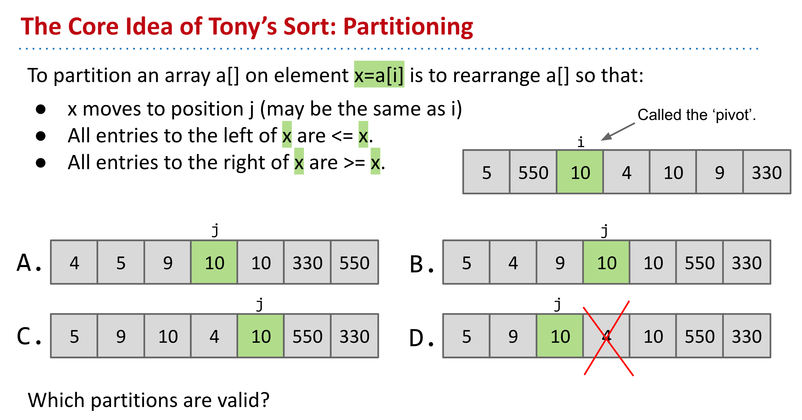
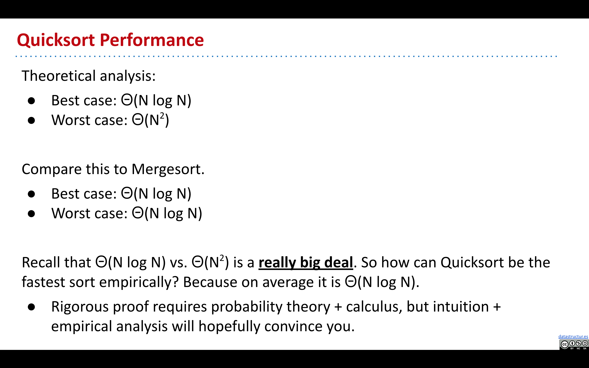
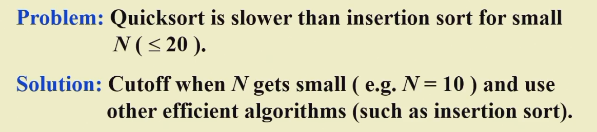
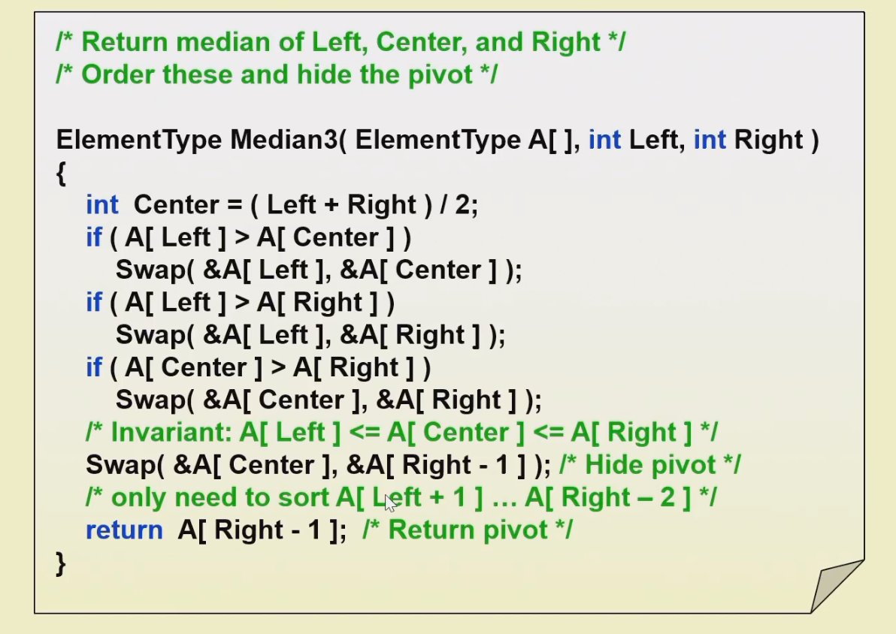
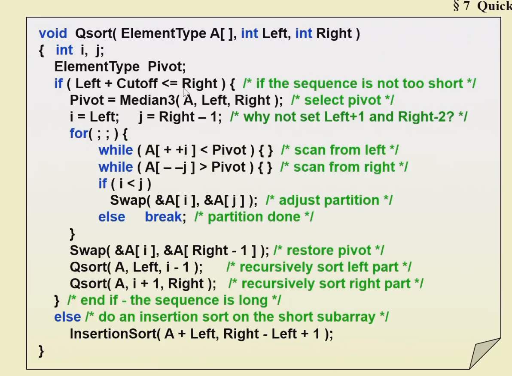
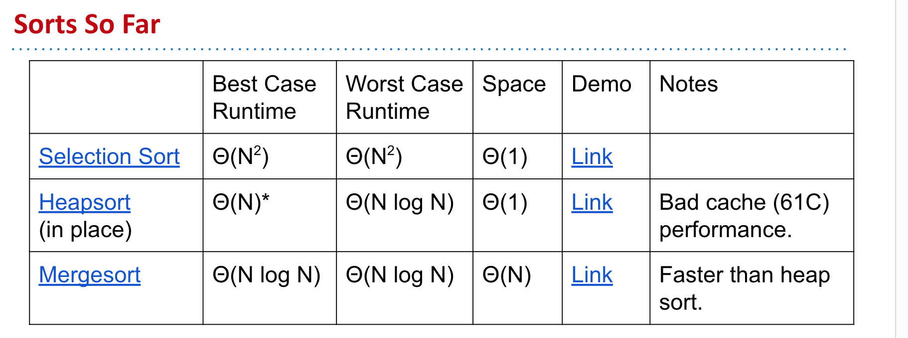
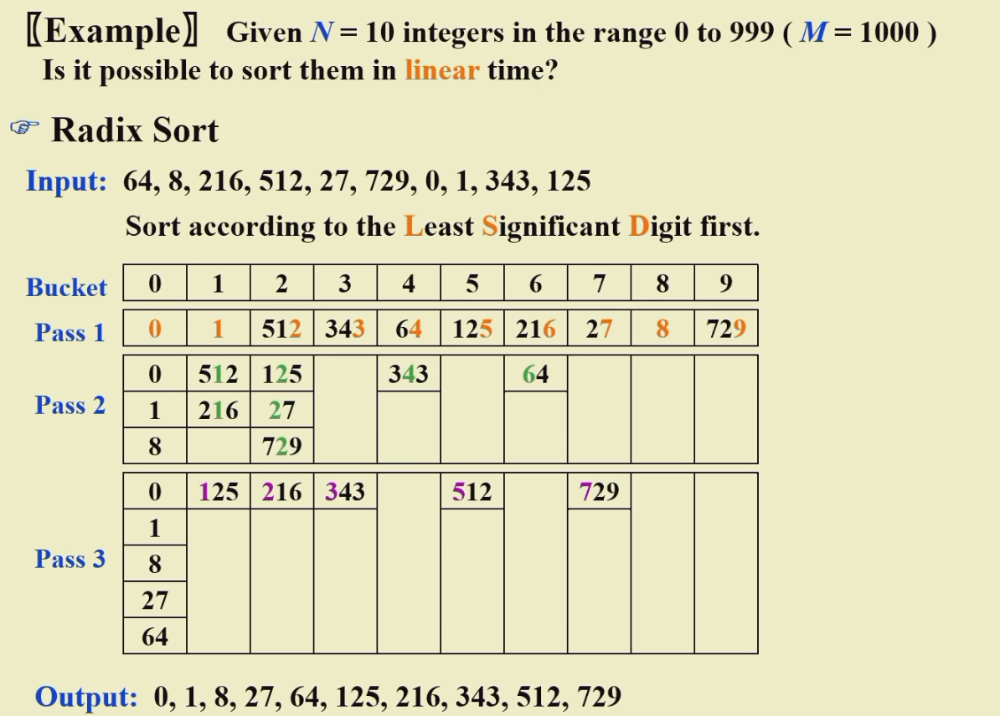

## 1 Sortings

### 1.1 Insertion Sort （aka Xsort）

#### 1.1.1 Simple Insertion Sort

```c
void InsertionSort(ElementType A[], int N) {
	int j, P;
	ElementType tmp;
	for (P = 1; P < N; P++) {
		tmp = A[P]; /* the next coming card */
		for (j = P; j>0 && A[j-1]>tmp; j--) {
			A[j] = A[j-1];
		}
		A[j] = tmp; /* place the new card at the proper position */
	} /* end for-P-loop */
}
```

每一次插入排序，可以纠正一个逆序对

#### 1.1.2 Insertion Sort with binary search

```c
int binary_search(int arr[], int low, int high, int key) {
    while (low <= high) {
        int mid = (low + high) / 2;
        if (arr[mid] == key) {
            return mid;
        } else if (arr[mid] < key) {
            low = mid + 1;
        } else {
            high = mid - 1;
        }
    }
    return low;
}
```

```c
void insertion_sort_binary_search(int arr[], int n) {
    for (int i = 1; i < n; i++) {
        int key = arr[i];
        int j = binary_search(arr, 0, i - 1, key);
        for (int k = i - 1; k >= j; k--) {
            arr[k + 1] = arr[k];
        }5
        arr[j] = key;
    }
}
```

### 1.2 Shell Sort 希尔排序

```c
void ShellSort(ElementType A[], int N) {
	int i, jk, Increment;
	ElementType Tmp;
	for (Inc)
}
```

希尔排序很不稳定

### 1.3 Heap Sort 堆排序

- Insert all items into a max heap, and discard input array. Create output array.
- Repeat N times:
	- Delete largest item from the max heap.
	- Put largest item at the end of the unused part of the output array.

- Use the magic of the heap to sort our data.
	- Getting items into the heap $O(N log N)$ time.
	- Selecting largest item: $Θ(1)$ time.
	- Removing largest item: $O(log N)$ for each removal.

- Overall **runtime** is $O(N log N) + Θ(N) + O(N log N) = O(N log N)$
	- Far better that selection sort!

- **Memory** usage is $Θ(N)$ to build the additional copy of all of our data.
	- Worse than selection sort, but probably no big deal (??).
	- Can eliminate this extra memory cost with same fancy trickery.

### 1.4 In-place Heapsort

#### 1.4.1 Phase1：Heapification

- Bottom up heapify input array
	- sink nodes in reverse level order: sink(k)
	- After sinking, guaranteed that tree rooted at position k is a heap
- Repeat N times
	- Delete Largest item from the max heap, swapping root with last item in the heap

Demo: https://docs.google.com/presentation/d/1z1lCiLSVLKoyUOIFspy1vxyEbe329ntLAVDQP3xjmnU/pub?start=false&loop=false&delayms=3000&slide=id.g12a2a1b52f_0_961

```c
void Heapsort(ElementType A[], int N) {
	int i;
	for (i = N/2; i >= 0; i--) { /* build heap */
		PercDown(A, i, N);
	}
	for (i = N - 1; i > 0; i--) {
		Swap(&A[0], &A[i]) /* DeleteMax */
		PercDown(A, 0, i);
	}
}
```

The average number of comparisons used to heapsort a random permutation of N distinct items is

$$
2NlogN - O(NloglogN)
$$

### 1.5 Merge Sort 归并排序

Demo: https://docs.google.com/presentation/d/1h-gS13kKWSKd_5gt2FPXLYigFY4jf5rBkNFl3qZzRRw/edit?usp=sharing

#### 1.5.1 递归版本

1. 定义一个递归函数 `merge_sort`，该函数接收一个待排序的数组 `arr`，以及子数组的起始索引 `start` 和结束索引 `end`。
2. 在 `merge_sort` 函数中，首先检查起始索引 `start` 是否小于结束索引 `end`，如果不小于，则表示数组长度为 0 或 1，无需排序，直接返回。
3. 计算子数组的中间索引 `mid`，可以使用 `(start + end) / 2` 来计算。
4. 递归调用 `merge_sort` 函数对左半部分子数组进行排序，即调用 `merge_sort(arr, start, mid)`。
5. 递归调用 `merge_sort` 函数对右半部分子数组进行排序，即调用 `merge_sort(arr, mid+1, end)`。
6. 完成左右子数组的排序后，调用合并函数 `merge`，将左右两个有序子数组合并为一个有序数组。合并函数 `merge` 的实现可以参考前面补充的 `merge` 函数。
7. 将合并后的有序数组复制回原始数组的对应位置，完成排序。
8. 最后，返回排序后的数组。

下面是使用伪代码表示的递归归并排序算法：

```python
function merge_sort(arr, start, end):
    if start >= end:
        return arr

    mid = (start + end) / 2

    merge_sort(arr, start, mid)
    merge_sort(arr, mid+1, end)
    merge(arr, start, mid, end)

    return arr
```

代码实现：

```c
void MergeSort(int Arr[], int N) {
    int *Temp = (int *)malloc(N * sizeof(int));
    if (Temp != NULL) {
        Sort(Arr, Temp, 0, N-1);
        free(Temp);
    } else {
        printf("No space for temp array!!!");
    }
}
// 递归排序
void Sort(int Arr[], int Temp[], int left, int right) {
    if (left < right) {
        int mid = (left + right) / 2;
        Sort(Arr, Temp, left, mid);
        Sort(Arr, Temp, mid+1, right);
        Merge(Arr, Temp, left, mid, right);
    } else {
        return ;
    }
}
// 归并
void Merge(int Arr[], int Temp[], int left, int mid, int right) {
    int l_pos = left;
    int r_pos = mid+1;
    int i = left;

    while (l_pos <= mid && r_pos <= right) {
        if (Arr[l_pos] <= Arr[r_pos]) {
            Temp[i] = Arr[l_pos];
            i++;
            l_pos++;
        } else {
            Temp[i] = Arr[r_pos];
            i++;
            r_pos++;
        }
    }

    while (l_pos <= mid) {
        Temp[i++] = Arr[l_pos++];
    }
    while (r_pos <= right) {
        Temp[i++] = Arr[r_pos++];
    }

    while (left <= right) {
        Arr[left] = Temp[left];
        left++;
    }
}
```

#### 1.5.2 迭代版本

迭代实现的归并排序是一种非递归的排序算法，它使用循环和迭代的方式进行数组的划分和合并。与递归实现相比，迭代实现的归并排序不需要使用函数调用栈，因此在一些情况下可能具有更好的性能。

以下是迭代实现归并排序的基本思路：

1. 定义一个辅助数组 `sorted`，用于存储排序后的元素。
2. 初始化子数组的长度 `length` 为 1，表示最初每个子数组只包含一个元素。
3. 进行循环迭代，直到子数组的长度超过待排序数组的长度。
4. 在每一轮迭代中，通过循环遍历数组，将相邻的两个子数组进行归并操作。
5. 归并操作的步骤与递归实现中的归并操作相同，将两个有序的子数组合并为一个有序数组。
6. 在归并操作后，将排序后的部分复制回原始数组中对应的位置。
7. 将子数组的长度 `length` 扩大两倍，准备进行下一轮迭代。
8. 最终，当子数组的长度 `length` 超过待排序数组的长度时，排序完成。

```python
function merge_sort(arr):
    length = 1
    n = length(arr)
    sorted = new array of size n

    while length < n:
        for start = 0 to n - length step 2 * length:
            mid = start + length - 1
            end = min(start + 2 * length - 1, n - 1)
            merge(arr, sorted, start, mid, end)

        copy sorted to arr

        length = 2 * length

    return arr
```

代码实现：

```c
void  merge_sort( ElementType list[],  int N )
{
    ElementType extra[MAXN];  /* the extra space required */
    int  length = 1;  /* current length of sublist being merged */
    while( length < N ) {
        merge_pass( list, extra, N, length ); /* merge list into extra */
        length *= 2;
    }
}
void merge_pass(ElementType list[], ElementType sorted[], int N, int length) {
    int i, j, k = 0;

    for (i = 0; i <= N - 2 * length; i += 2 * length) { // complete 2 equal length
        int left = i;
        int right = i + 2 * length - 1;
        int mid = (right + left) / 2;
        int l_pos = left;
        int r_pos = mid + 1;

        if (right >= N) {
            right = N - 1;
        }

        while (l_pos <= mid && r_pos <= right) { //
            if (list[l_pos] < list[r_pos]) {
                sorted[k++] = list[l_pos++];
            } else {
                sorted[k++] = list[r_pos++];
            }
        }

        while (l_pos <= mid) {
            sorted[k++] = list[l_pos++];
        }
        while (r_pos <= right) {
            sorted[k++] = list[r_pos++];
        }

    }

    /* 最后进行一次归并剩余元素 */
    int left = i;
    int mid = i + length - 1;
    int right = N - 1;

    /* 归并操作 */
    k = left;  /* k 用于遍历 sorted[] 数组 */
    int l = left;  /* l 用于遍历左半边子序列 list[left:mid] */
    int r = mid + 1;  /* r 用于遍历右半边子序列 list[mid+1:right] */

    while (l <= mid && r <= right) {
        if (list[l] <= list[r]) {
            sorted[k++] = list[l++];
        } else {
            sorted[k++] = list[r++];
        }
    }

    while (l <= mid) {
        sorted[k++] = list[l++];
    }

    while (r <= right) {
        sorted[k++] = list[r++];
    }

    for (j = 0; j < N; j++) {
        list[j] = sorted[j];
    }
}
```

### 1.6 Quick Sort

#### 1.6.1 Core Idea



#### 1.6.2 QuickSort Demo

https://docs.google.com/presentation/d/1QjAs-zx1i0_XWlLqsKtexb-iueao9jNLkN-gW9QxAD0/edit#slide=id.g463de7561_042

在这个 demo 中，总是选取 A[0] 作为 pivot，其实在排好序的情况下容易导致 worst case 的出现，在下文有解决方法

#### 1.6.3 Complexity Compare



#### 1.6.4 Avoiding Worst Cases

- Pick pivots randomly. (random generation is expensive)
- Shuffle before you sort.
- Median of Tree Partitioning: Pivot = mid(left, center, right)

#### 1.6.5 Partition Strategy

#### 1.6.6 Small Array



#### 1.6.7 伪代码



```c
ElementType Median3(ElementType A[], int Left, int RIght) {
	int Center = (Left + Right) / 2;
	if (A[Left] > A[Center]) {
		Swap(&A[Left], &A[Right]);
	}
	if (A[Left] > A[RIght]) {
		Swap(&A[Left], A[Right]);
	}
	if (A[Center] > A[Right]) {
		Swap(&A[Center], &A[Right]);
	}
	/*.A[Left] < A[Center] < A[Right] */
	Swap(&A[Center], $A[Right - 1]); /* Hide Pivot */
	return A[Right - 1];
}

```



```c
void Qsort(ElementType A[], int Left, int Right) {
	int i, j;
	if (Left + Cutoff <= Right) { // if the sequence is not too short
		Pivot = Median3(A, Left, Right);
		i = Left; j = Right - 1;
		for (;;) {
			while (A[++i] < pivot) {}
			while (B[--j] > pivot) {}
			if (i < j) {
				Swap(&A[i], &A[j]);
			} else {
				break;
			}
		}
		Swap(&A[i], &A[Right - 1]); // restore pivot
		Qsort(A, Left, i-1);
		Qsort(A, i+1, Right);
	} else {
		InsertionSort(A+Left, Right-Left+1);
	}
}
```

### 1.7 Conclusion



### 1.8 Bucket Sort 桶排序

#### 1.8.1 Radix Sort 基准排序

#### 1.8.2 Least Significant Digit first LSD 按照最小的位来排

放入 bucket 的时候按照上一轮的顺序读



#### 1.8.3 Most significant Digit first MSD 按照最大的位来排

