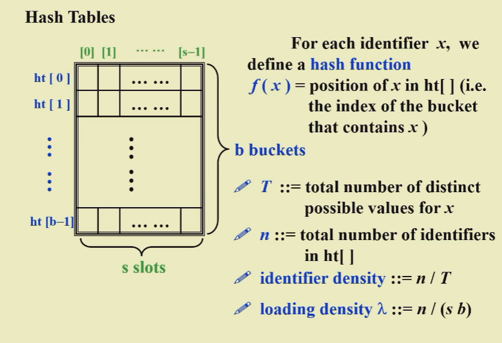
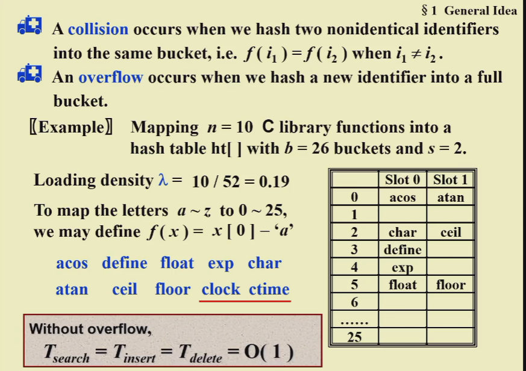
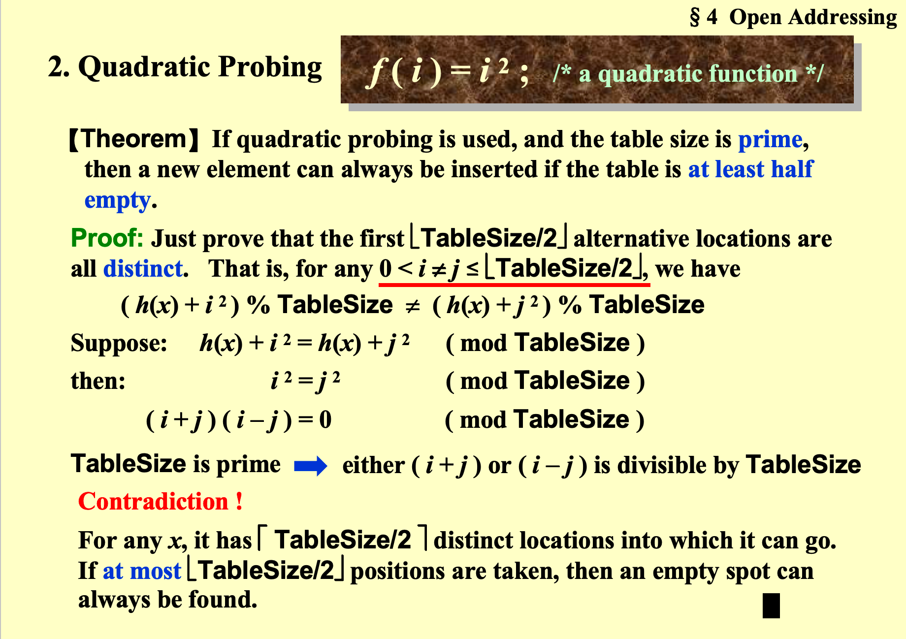
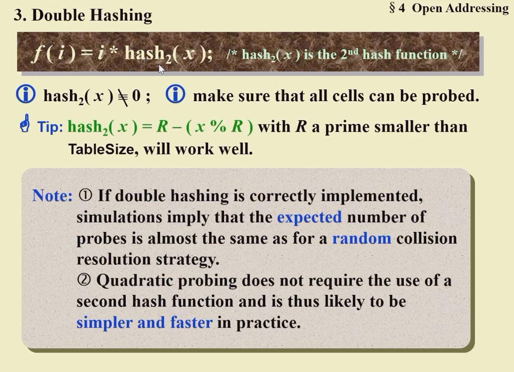

## 1 Symbol Table ADT

### 1.1 Hash Table





### 1.2 线性探测

### 1.3 二次探测



设置三种情况：Legitimate，empty，deleted

伪代码实现 Find：

```cpp
Position  Find ( ElementType Key, HashTable H ) 
{   Position  CurrentPos; 
    int CollisionNum; 
    CollisionNum = 0; 
    CurrentPos = Hash( Key, H->TableSize ); 
    while( H->TheCells[CurrentPos].Info != Empty && 
	H->TheCells[ CurrentPos ].Element != Key ) { 
		CurrentPos += 2 * ++CollisionNum - 1;  /* Why? */
		if ( CurrentPos >= H->TableSize )  CurrentPos -= H->TableSize; 
    } 
    return CurrentPos; 
} 

```

$$
f(x+i+1) = f(x+i) + 2\times (i+1) - 1
$$

伪代码实现 Insert：

```cpp
void  Insert ( ElementType Key, HashTable H ) 
{ 
    Position  Pos; 
    Pos = Find( Key, H ); 
    if ( H->TheCells[ Pos ].Info != Legitimate ) { /* OK to insert here */ 
		H->TheCells[ Pos ].Info = Legitimate; 
		H->TheCells[ Pos ].Element = Key; /* Probably need strcpy */ 
    } 
} 

```

### 1.4 Double Hashing

$$
f(i) = i * hash_2(x)
hash_2(x) = R-(x\% R)
$$



### 1.5 ReHashing

1. Table 快满了（Half Full）
2. 插入出错
3. 预先设置一个 Loading Rate，达到 Loading Rate 就 ReHash