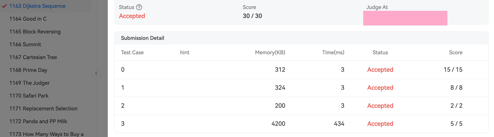

<div class="cover" style="page-break-after:always;font-family:方正公文仿宋;width:100%;height:100%;border:none;margin: 0 auto;text-align:center;">
    <div style="width:60%;margin: 0 auto;height:0;padding-bottom:10%;">
        </br>
        
    </div>
    </br></br></br></br></br>
    <div style="width:60%;margin: 0 auto;height:0;padding-bottom:40%;">
        
	</div>
    </br></br></br></br></br></br></br></br>
    <span style="font-family:华文黑体Bold;text-align:center;font-size:20pt;margin: 10pt auto;line-height:30pt;">《数据结构基础》</span>
    <p style="text-align:center;font-size:14pt;margin: 0 auto">实验报告 </p>
    </br>
    </br>
    <table style="border:none;text-align:center;width:72%;font-family:仿宋;font-size:14px; margin: 0 auto;">
    <tbody style="font-family:方正公文仿宋;font-size:12pt;">
    	<tr style="font-weight:normal;"> 
    		<td style="width:20%;text-align:right;">周　　次</td>
    		<td style="width:2%">：</td> 
    		<td style="width:40%;font-weight:normal;border-bottom: 1px solid;text-align:center;font-family:华文仿宋"> </td>     </tr>
    	<tr style="font-weight:normal;"> 
    		<td style="width:20%;text-align:right;">上课时间</td>
    		<td style="width:2%">：</td> 
    		<td style="width:40%;font-weight:normal;border-bottom: 1px solid;text-align:center;font-family:华文仿宋"> </td>     </tr>
    	<tr style="font-weight:normal;"> 
    		<td style="width:20%;text-align:right;">授课教师</td>
    		<td style="width:2%">：</td> 
    		<td style="width:40%;font-weight:normal;border-bottom: 1px solid;text-align:center;font-family:华文仿宋">杨子祺 </td> </tr>
    	<tr style="font-weight:normal;"> 
    		<td style="width:20%;text-align:right;">日　　期</td>
    		<td style="width:2%">：</td> 
    		<td style="width:40%;font-weight:normal;border-bottom: 1px solid;text-align:center;font-family:华文仿宋">2023/9/30</td>     </tr>
    </tbody>              
    </table>
</div>


## Chapter 1: Introduction

This report aims to present the algorithm for determining whether a sequence is a Dijkstra sequence and provide the testing results. In this chapter, we will provide background information and state the problem.

### 1.1 Background

A Dijkstra sequence is a special type of sequence in which the shortest path values between adjacent nodes are non-decreasing. It has significant applications in graph theory and network routing. This report discusses an algorithm for determining if a given sequence satisfies the properties of a Dijkstra sequence.

### 1.2 Problem Statement

Our objective is to design an algorithm that can efficiently determine whether a sequence is a Dijkstra sequence. Given a sequence, we need to determine if it satisfies the non-decreasing shortest path property.

## Chapter 2: Algorithm Specification

In this chapter, we will provide a detailed specification of the algorithm for determining whether a sequence is a Dijkstra sequence.

### 2.1 Input Specification

Each input file consists of a single test case. The test case begins with a line containing two positive integers Nv ($≤10^3$) and Ne ($≤10^5$), representing the total number of vertices and edges, respectively. The vertices are numbered from 1 to Nv.

Next, there are Ne lines, each describing an edge by providing the indices of the vertices at the two ends, followed by a positive integer weight ($≤100$) of the edge. It is guaranteed that the given graph is connected.

Finally, the number of queries, $K$, is given as a positive integer not exceeding $100$. This is followed by $K$ lines, each representing a sequence that contains a permutation of the Nv vertices. It is assumed that the first vertex in each sequence is the source.

All the values in a line are separated by a space.

### 2.2 Output Specification

For each of the $K$ sequences, print "Yes" in a separate line if it is a Dijkstra sequence, or "No" if it is not.

### 2.3 Algorithm Flow

The process for determining whether a sequence is a Dijkstra sequence is as follows:

1. For each query sequence, perform the following steps:
2. Initialize the shortest path array `dis` and the visited flag array `visit`, setting their initial values to maximum and `false`, respectively.
3. Set the shortest path from the starting node `v[1]` to itself, `dis[v[1]]`, to 0.
4. Repeat the following loop n times (where n is the number of nodes):
    - Select the node u with the minimum shortest path value among the unvisited nodes, mark it as visited, and update the shortest path values of its neighboring nodes.
    - Find the minimum `dis[j]` value among the unvisited nodes and mark the corresponding node as u.
    - Iterate through the nodes v adjacent to u. If node v is unvisited and a shorter path can be obtained through node u, update `dis[v]` to `dis[u] + G[u][v]`.
    - If no minimum `dis[j]` value is found among the unvisited nodes (all nodes have been visited), exit the loop.
5. For each pair of adjacent nodes v[i] and v[i+1] in the sequence, check their corresponding shortest path values `dis[v[i]]` and `dis[v[i+1]]`.
    - If `dis[v[i]] > dis[v[i+1]]`, the sequence does not satisfy the non-decreasing shortest path property. Set a flag `flag` to false.
6. Based on the value of the flag `flag`, determine whether the sequence is a Dijkstra sequence:
    - If `flag` is true, output "Yes" to indicate that the sequence is a Dijkstra sequence.
    - If `flag` is false, output "No" to indicate that the sequence is not a Dijkstra sequence.

## Chapter 3: Testing Results

In this chapter, we present the testing results of the algorithm.

To run your own testcases, enter the code directory and open your terminal. Use command line to automatically compile and run it our compile it yourself.

```Makefile
make run
```

like this:

![[Pasted image 20231128152728.png]]

### 3.1 Sample Input and Output

#### Sample Input and Output

Input:

```c
5 7
2 3 1
2 4 1
2 5 2
3 5 1
3 4 1
1 2 2
1 5 1
4
2 3 4 5 1
3 2 1 5 4
5 1 3 4 2
5 3 1 2 4
```

Output:

```c
Yes
Yes
Yes
No

```

#### Other testcases and corner cases:

```c
1 0
1
1

Yes
```

```c
2 1
1 2 1
1
1 2

Yes
```

```c
5 7
2 3 1
2 4 1
2 5 2
3 5 1
3 4 1
1 2 2
1 5 1
4
2 3 4 5 1
3 2 1 5 4
5 1 3 4 2
5 3 1 2 4

Yes
No
Yes
Yes
```



## Chapter 4: Analysis and Comments

#### Time Complexity

The time complexity of the algorithm depends on the number of vertices (Nv) and edges (Ne) in the graph, as well as the number of queries (K) and the length of each sequence. Let's analyze the time complexity of the algorithm step by step:

1. Input Parsing: Parsing the input to extract the graph information and sequences takes $O(Ne + K)$ time.
2. Algorithm Execution:
    - Initializing the shortest path array and visited flag array takes $O(Nv)$ time.
    - The main loop that iterates Nv times has a complexity of $O(Nv^2)$, as in each iteration, we need to find the node with the minimum shortest path value from the unvisited nodes, which can take $O(Nv)$ time.
    - Updating the shortest path values of neighboring nodes takes $O(Nv)$ time in each iteration.
    - Checking the non-decreasing shortest path property of each sequence takes $O(K \times L)$ time, where L is the average length of the sequences.

Overall, the time complexity of the algorithm can be approximated as $O(Nv^2 + K \times L)$, where Nv is the number of vertices, K is the number of queries, and L is the average length of the sequences.

#### Space Complexity

The space complexity of the algorithm is determined by the additional data structures used during the execution. Let's analyze the space complexity:

1. Input Storage: Storing the graph information requires $O(Ne)$ space to store the edges.
2. Algorithm Execution:
    - The shortest path array and visited flag array each require $O(Nv)$ space.
    - Additional variables and arrays used during the execution have a negligible impact on the overall space complexity.

Therefore, the space complexity of the algorithm is $O(Ne + Nv)$, where Ne is the number of edges and Nv is the number of vertices in the graph.

## Chapter 5: Appendix: Source Code in C

Here, we include the source code of the algorithm implemented in the C programming language and Makefile.

```c
/**
 * @file Dijkstra.c
 * @brief Dijkstra algorithm and its application
 * @details This program implements the Dijkstra algorithm to check whether a given sequence of vertices represents a valid path in a graph.
 * The program reads the graph and the sequences from the user and checks each sequence using the Dijkstra algorithm.
 * If the sequence is a valid path, it prints "Yes"; otherwise, it prints "No".
 *
 * The Dijkstra algorithm calculates the shortest path between a source vertex and all other vertices in a weighted graph.
 * It uses a greedy approach, iteratively selecting the vertex with the smallest distance to update the distances of its adjacent vertices.
 *
 * This program assumes the graph is represented as an adjacency matrix.
 */

#include <stdio.h>
#include <stdlib.h>
#include <stdbool.h>

/**
 * @brief Define the maximum number of vertices and the infinite distance value
 */
#define MaxN 1001
#define INF 65535

typedef int ElementType;

int G[MaxN][MaxN] = {0}; /**< Adjacency matrix representing the graph */
int Nv, Ne; /**< Number of vertices and edges in the graph */

/**
 * @brief Reads the graph from the user input
 */
void ReadGraph(void);

/**
 * @brief Checks whether the given sequence represents a valid path using Dijkstra algorithm
 * @param Seq The sequence of vertices in the path
 * @return true if the sequence represents a valid path, false otherwise
 */
bool IsDij(int *Seq);

/**
 * @brief The main function
 * @return The exit status of the program
 */
int main() {
    ReadGraph(); // Initialize the Graph
    int K = 0, i = 0;

    scanf("%d", &K);

    for ( i = 0; i < K; i++ ) {
        int j = 0;
        int Seq[MaxN] = {0};

        for ( j = 0; j < Nv; j++ ) {
            scanf("%d", &Seq[j]);
        }

        if ( IsDij(Seq) ) {
            printf("Yes\n");
        } else {
            printf("No\n");
        }
    }
    return 0;
}

/**
 * @brief Reads the graph from the user input
 */
void ReadGraph(void) {
    scanf("%d %d", &Nv, &Ne);
    int i = 0, weight = 0;

    for (int i = 0; i < Nv + 1; i++ ) { // initialize the Graph and set the weight of edge to infinite
        for (int j = 0; j < Nv + 1; j++ ) {
            G[i][j] = INF;
        }
    }

    for ( i = 0; i < Ne; i++ ) {
        int v1, v2;
        scanf("%d %d %d", &v1, &v2, &weight);
        G[v1][v2] = weight;
        G[v2][v1] = weight;
    }
}

/**
 * @brief Checks whether the given sequence represents a valid path using Dijkstra algorithm
 * @param Seq The sequence of vertices in the path
 * @return true if the sequence represents a valid path, false otherwise
 */
bool IsDij(int *Seq) {
    int dist[MaxN]; /**< Array to store the shortest distance from the source vertex */
    bool known[MaxN]; /**< Array to track whether a vertex is known or not */

    // Initialize the distance array and known array
    for (int i = 1; i < Nv + 1; i ++) {
        dist[i] = INF; // Initialize the distance of all vertices to infinity
        known[i] = false; // Set all vertices as unknown
    }

    dist[Seq[0]] = 0; // Set the distance of the source vertex to 0

    for (int i = 0; i < Nv; i ++) { // Calculate the distance array
        int min = INF;
        int min_index = -1;

        // Find the unknown vertex with the smallest distance
        for (int j = 1; j < Nv + 1; j ++) {
            if (known[j] == false && dist[j] < min) {
                min = dist[j];
                min_index = j;
            }
        }

        if (min == INF) { // If no vertex is found, it means the remaining vertices are unreachable
            break;
        }

        known[min_index] = true; // Mark the vertex as known

        // Update the distance array
        for (int j = 1; j < Nv + 1; j ++) {
            if (known[j] == false && G[min_index][j] != INF) {
                if (dist[j] > dist[min_index] + G[min_index][j]) {
                    dist[j] = dist[min_index] + G[min_index][j];
                }
            }
        }
    }

    for (int i = 0; i < Nv-1; i ++) { // Check the distance array
        if (dist[Seq[i]] > dist[Seq[i + 1]]) {
            return false; // If the distance of any vertex violates the shortest path condition, return false
        }
    }

    return true; // If the distances of all vertices satisfy the shortest path condition, return true
}

```

Makefile:

```Makefile
# 定义编译器和编译选项
CC = gcc
CFLAGS = -Wall -lm
FILENAME = Dijkstra.c
FILEOUT = Dijkstra.out

# 默认目标
all:
	@echo "Usage: make the source code to compile and run."

# 自定义规则：通过文件名编译和运行
run:
	mkdir -p build
	$(CC) $(CFLAGS) $(FILENAME) -o build/$(FILEOUT)
	build/$(FILEOUT)

clean:
	rm -rf build/

```

- I hereby declare that all the work done in this project titled RedBlackTree is of my independent effort.