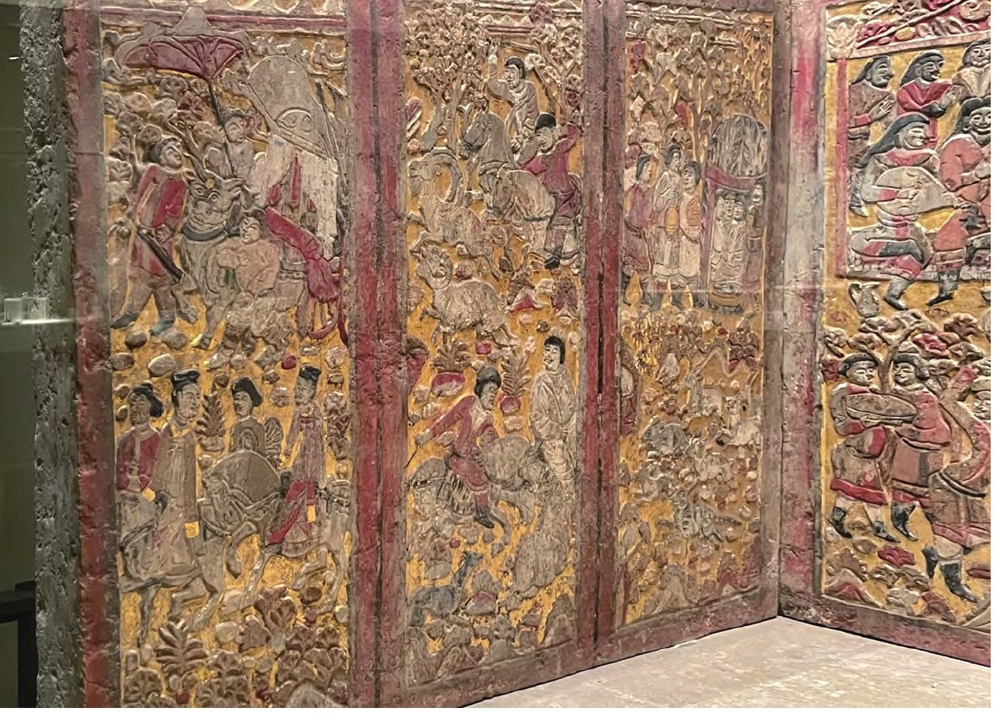
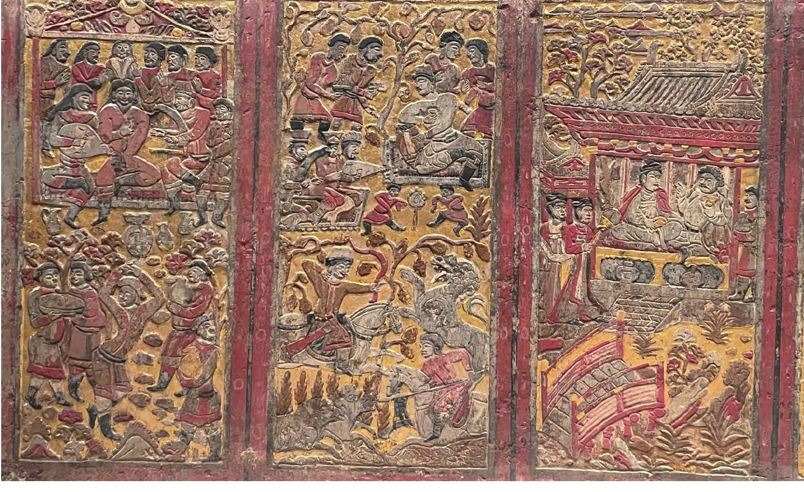

# 安伽墓介绍

## 地理位置

安伽墓是一座位于西安未央区大明宫乡炕底寨村的北周粟特人古墓葬，于2000年5月至7月间发掘出土，同北周史君墓相距约2.5千米。

## 墓主简介

根据墓志记载，墓主安伽，字大伽，来自姑藏昌松（位于甘肃武威市，曾是丝绸之路要冲，北朝时期聚居大量中亚、西亚人），从他的姓氏来看，应是源自中亚安国的粟特人。[2]曾任北周大都督、同州萨保。其父安突建曾任“冠军将军”、眉州（今四川眉山）刺史，母亲杜氏为昌松县君，也就是凉州（今甘肃武威）汉人。安伽于大象元年（公元579年）五月逝世，终年62岁。

## 墓葬简介

安伽墓由斜坡墓道、五个天井、五个过洞、砖砌甬道以及墓室组成，石制墓门门额有彩绘雕刻的祆教火坛和半人半鸟祭司图像。墓室内发现一具围屏石榻，由11块石板构成，共雕绘56幅图案，全部彩绘贴金，内容有出行、狩猎、乐舞、宴饮等，其中人物多为胡人，着胡服，作胡舞，充满异域风情。这些图案的组成和布局都有明显的对称性，特别是左右两侧图案的对称性更强。

粟特人大多信仰祆教，通常以火烧的方式处理遗体。安伽的遗骨就经过火烧，而且放置在墓门之外。同隋朝的虞弘墓相比，安伽墓只有一具围屏石榻，虞弘墓只有石椁，两者都没有棺，这与汉人葬俗大不相同。与同为北周时期的另外两座粟特人墓葬——康业墓及史君墓相比，安伽墓的汉化程度高于史君墓，但低于康业墓。

## 墓碑图像

左侧石屏中的第一块石板以出行仪仗为题，画面近景处雕凿了两名女子骑马出游的场景：两女子身穿汉式窄袖襦裙，发髻高盘，身骑骏马，为北朝晚期贵族妇女的典型装扮，右侧女子在襦裙之外还加有一件披风，更显高贵，或为墓主夫人的形象。石板远景为三位侍从形象，以及一辆正在行驶的牛车，牛旁三位侍者做胡人服饰装扮，手持华盖者与领队侍者皆回首注视车驾，另一人则驱赶着牛车。牛车装饰华丽，帷幕重重，应为墓主人所乘车驾，但车中无人，并不见墓主形象。石板的顶部刻有连绵的山峰与浮动的云气，象征着远处的山峦，表现出墓主夫妇正活动于山林之中。

左侧第二块石板为林中狩猎题材的图像，画面的近景与远景皆凿刻了勇士正在狩猎的场景。画中共四名男子，身着胡服，近景处的两名男子身着翻领窄袖骑装，远景胡人男性身着圆领窄袖骑装，正两两一组地向相反方向追逐各自的猎物。画面顶部依然刻画有峰峦叠嶂，绵延不绝。

左侧第三块石板为林中宴饮图，画中主要人物位于远景处，墓主人及其友人一同跽坐于圆顶帐篷之内，身后林荫茂盛，远方山峦重重，云气缭绕。帐篷为粟特地区常见的生活用具，体现了墓主身为粟特人的起居习惯和民俗特征。

安伽石榻中部石屏由六块石板拼接而成（图2），第一块石板雕刻了一突厥人正端坐于帐篷中观看乐舞的场景，其周围有乐师环绕，或坐或立。其中披着长发的是突厥人，短发或戴帽的是粟特人。[1]65帐篷装饰有祆教信仰中常见的日、月及莲花题材纹饰。近景处，一男子正在欢快地跳着胡旋舞，气氛十分欢愉。

第二块石板图像为乐舞狩猎图。画面远景呈现了墓主人头戴虚帽，身着高领贴身上衣，坐于地毯之上，肘下垫有隐囊，神情放松，举杯欲饮的景象，其前方有舞者与乐师正在舞蹈和演奏。近景处有两位勇士，一位正挽弓射杀腾空跃起的狮子；另一位手持长矛，刺向迎面扑来的野猪。

石屏中第三、四块石板位于整座石榻围屏的中心部位，图像应为整体表现的核心内容，并且具有一定的礼仪性含义。第三块石板图像中墓主人夫妇同时出现，二人对坐于山林之中的凉亭内，有双壶门式榻及屏风。凉亭是一座传统中国式歇山顶挑檐亭式建筑，斗拱结构，雕梁画栋，色彩鲜艳。[2]25男主人为胡人装扮，手持酒杯，夫妇二人好似正在交谈对饮，神态端庄，气氛和睦，画面充满生活气息。女主人身穿小袖高腰襦裙，外披披袍。[1]65亭外有两侍女同样身着襦裙，立于一旁。画面近景处为一座小桥，顶部还有远山连绵，云气飘浮。

第四块石板图像远景处刻画了突厥人的代表与墓主人所代表的粟特人友好交往的场景，两人正相互招呼示意。（图3）画面中墓主人形象更靠近中心位置，突厥人则处于边缘，以区分图中人物主次。图像近景处呈现了两族百姓于一帐篷内游戏娱乐的景象，证实两族的和睦往来。联系墓主的官职推测可知，民族之间的和睦相处，展现出了墓主生前为国所做的政绩。

第五块石板画像以林中宴饮图像为题，墓主人在山林之中宴请突厥宾客，二人坐于圆顶帐篷之内，相谈甚欢。帐篷外还有其他宾客把酒言欢，气氛融洽。后方刻有崇山峻岭，绿叶成荫。近景处为等待主人的仆役形象。

第六块石板图像依然为宴饮乐舞题材，墓主人宴请的对象亦为突厥人。二人坐于歇山顶凉亭之中的榻上，墓主人身着翻领胡服，形体雕刻略大于突厥人，显示出墓主的身份高于此人，突显了墓主的主人身份。近景处有舞者在跳舞。

右侧石屏由三块石板组成，图像内容题材与左侧石屏的三块石板相似，好似左右两边的图像内容在相互对应。（图4）图像从左至右依次为狩猎图、宴饮图以及出行仪仗图。这三幅图像人物的行为依旧发生在山林之中，狩猎图中可见远处的群山；宴饮图右下角处出现了庖厨画像；出行图像的远景与左侧石屏相呼应，仍为牛车车架与回首张望的侍从形象，近景处为墓主夫妇形象，女主人身着襦裙，准备与男主人一同登上石桥。

> 左侧石屏图像123

> 中侧石屏图像456

## 墓志

【志盖】大周同州 萨保安君 之墓志铭
> 这是唐朝同州（位于今天陕西省）的萨保（一种官职）安君的墓志。

【志文】大周大都督同州萨保安君墓志铭 /
君讳伽，字大伽，姑臧昌松人。其先黄帝之苗裔，分/族因居命氏，世济门风，代增家庆。 父突建，冠军/将军，眉州刺史，幼擅家声，长标望实，履仁蹈义，忠/君信友。母杜氏，昌松县君，婉兹四德，弘此三从，肃/穆闺闱，师仪乡邑。君诞之宿祉，蔚其早令，不同流/俗，不杂嚣尘，绩宣朝野，见推里闬。遂除同州萨保。/君政抚闲合，远迩祗恩，德盛位隆，于义斯在。俄除/大都督。董兹戎政，肃是军容，志效鸡鸣，身期马革。/而芒芒天道，杳杳神祇，福善之言，一何无验？周大/象元年五月，遘疾终于家，春秋六十二。其年岁次/己亥十月己未朔， 厝于长安之东，距/城七里。但陵谷易徙，居诸难徙，佳城有斁，镌勒□/无亏。其词曰： /
基遥转固，派久弥清。光逾照庑，价重连城。方鸿节/鹜，譬骥齐征。如何天道，奄垐泉扃。寒原寂寞，旷野 / 萧条。岱山终砺，拱木俄撨。佳城郁，陇月昭昭，缣□/易 ，金石难销。

> - 君讳伽，字大伽：墓主名叫伽，字大伽。在中国，人们除了有正式的名字，还会有字，类似于一个人的别名或者补充名。
> - 姑臧昌松人：表明安君的家乡是姑臧的昌松地区，即今天甘肃省武威市一带。
其先黄帝之苗裔，分族因居命氏：安君的家族声称自己是黄帝后代，分支定居在命氏（一个地名）。
> - 世济门风，代增家庆：一直维持着良好的家风，每一代都使家族更加昌盛。
> - 父突建：安君的父亲名叫突建，曾是冠军将军，眉州刺史，是一个有声望的军人。
> - 母杜氏：安君的母亲是杜氏，昌松县君，也即昌松地区的女性贵族。
> - 君政抚闲合，远迩祗恩：安君的治理和慰问民众都得体，受到远近人们的感激。
> - 于义斯在：他秉持正义的原则行事。
> - 周大象元年五月，遘疾终于家：安君逝世于北周静帝大象元年的五月，即579年。
> - 春秋六十二：安君享年六十二岁。
> - 其年岁次己亥十月己未朔，厝于长安之东，距城七里：安君的墓地位于长安（今天的西安）东面，距离城区七里的地方。
> - 但陵谷易徙，居诸难徙：表达了墓地虽易于变动，但家的位置却不易变动的感慨。
> - 其词曰：基遥转固...金石难销：这部分是墓志铭文的诗篇，表达了对安君品德的赞扬以及对生死哲理的感慨。

【疏证】：安伽为昭武九姓之安国后裔，似可无疑。安伽死于北周静帝大象元年（579），六十二岁，则其生年当在北魏孝明帝神龟元年（518）。安伽籍贯姑臧昌松，可见姑臧昌松，应是凉州粟特人较集中的地方。

> 这是对墓志铭进行的额外解释，说明安君可能是北周昭武九姓中安国的后裔，而且安君死于579年，享年62岁，生于518年。还提到了安君籍贯姑臧昌松的地理和民族背景信息。

