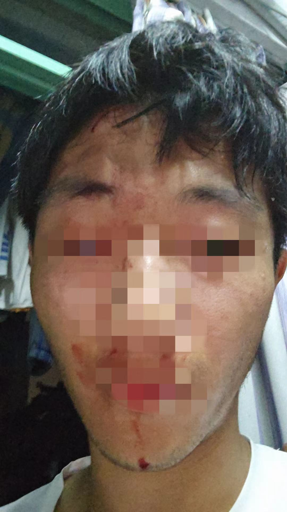
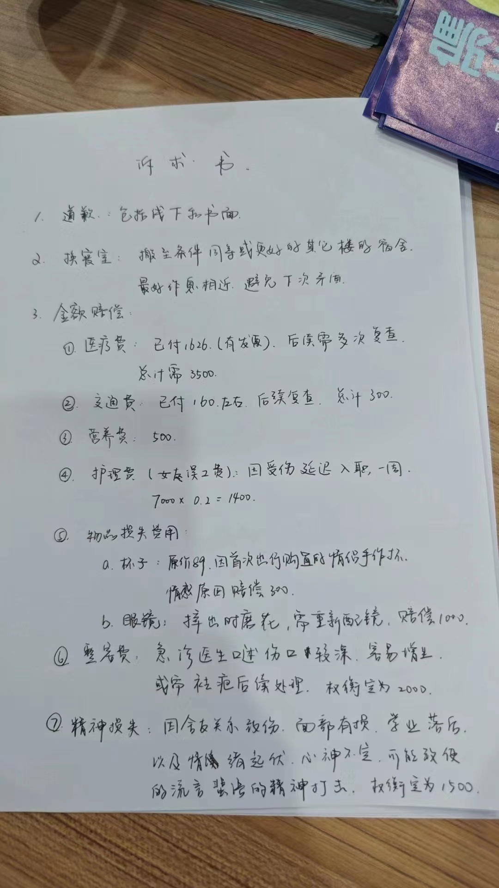

# 因与室友作息不合，某985高校退伍军人竟大打出手？

> 近日，浙江大学的徐某发文称，2024年6月1日晚，由于他回宿舍时间过晚影响室友睡眠，导致室友情绪失控并对徐某进行殴打，导致其头部、面部、眼部受创，徐某即刻报警，他的朋友们也第一时间赶到现场陪同并且赶去医院，目前徐某已经在医院接受治疗，警方也已经介入调查。
据了解，涉事室友是一名退伍军人，目前已进行道歉赔偿并得到调解。

那么，当晚到底发生了什么？连日来，笔者采访了多位知情人士，了解到了更多的细节，并获得该事件调解录像以及诉求书复印件，还原此事件始末。

### 伤者讲述：升学压力大，尝试解决作息问题无果，被打很突然

伤者讲述，有关作息的矛盾已经存在一段时间，他和室友都是大三的学生，面临着保研等升学压力，但他们之前并无竞争关系。
在该室友提出徐某在宿舍学习时间过晚后，由于学业压力无法缩减学习时间，徐某选择在外学习后晚回宿舍，但室友仍然不满。在此次被殴事件发生前，已有一名室友因此搬出宿舍，一名室友与他人交换了宿舍。
事发前一晚，徐某在外与朋友们聚会未回宿舍，接到该室友数个电话，他表示环境嘈杂并且当晚不会回宿舍影响室友休息，之后将手机放在一边，但电话未挂断。
案发当晚，徐某本意进行交流解决问题，但在室友回到宿舍后，在他没有防备的情况下室友突然对他右脸进行殴打，将其打倒在地，导致徐某的头部撞到窗框，头部、面部、眼部受伤，当场流血，桌上的两个杯子也被打碎。
事发后，徐某立即报警，室友被警方控制，徐某的朋友们也第一时间赶到现场陪同并赶去医院，验伤后准备前往警局立案。

  

> 徐某被殴打后的伤势

### 打人者供述：事发前一天我有理有据，他一点没听；事发当天殴打一次后停手，表现出后悔情绪

打人者供述，他是一名退伍军人，对于作息问题，他认为徐某的行为影响了室友的休息。他曾多次与徐某沟通，希望徐某能够尽早回宿舍，但徐某并未改变行为。在事发前一天，他曾多次打电话给徐某，并且在电话一端有理有据地进行了批评，但徐某由于将电话放在一边，并未听见。
事发当晚，将徐某打倒在地后，打人者立即停手，没有继续殴打，之后警方介入。
事发后该打人者表现出了强烈的后悔情绪，不断说明“都是我的错，我不该打人”，提出“你作业不要担心我帮你做”，希望能够得到原谅。

### 派出所协助调解：保卫处已失去信用，建议当日解决

验伤显示，徐某额头处三厘米的裂开较深的伤口，缝针处理并大概率留疤；左眼部损伤，仍处于炎症期；牙周膜受损，需要定期复查。徐某的朋友们表示，徐某的伤势较重，希望立案。
6.1日晚报案以及6.2下午警局调解时，两名学生的辅导员不断声称，希望次日解决，并且与学校保卫处约的时间是6.3日，希望将学生带回学校保卫处进行处理。
但6.3日已过可立案时间，派出所所长表示，学校保卫处已失去信用，此前出现了多次学生打架被学校保卫处带走调解但未解决的事件，导致受害学生错过立案时间再次报案，违反了该派出所正常的司法流程，建议徐某及其朋友们6.2日当天决定接受调解或立案。

### 接受调解，获赔2万，并更换宿舍楼，未给予打人者处分

在朋友的帮助下，徐某给出了诉求书。
他提出根据医疗、交通、护理、物品损失、面部修复、精神损失等费用得出2万赔偿金额。辅导员表示，两万对于一个学生来说有些太多了，而徐某一位现役军人朋友并未退让，对打人者一句“你退伍费多少”的质问，让他们哑口无言。
最终，6.2日下午两方在公安局和辅导员见证下达成调解，在徐某的同意下没有对打人者进行处分，达成线下道歉，和学院的住宿楼更换，以及两万金额赔偿，其中一万在一周内给徐某，还有一万写了欠条在工作后三个月内给徐某。

  

