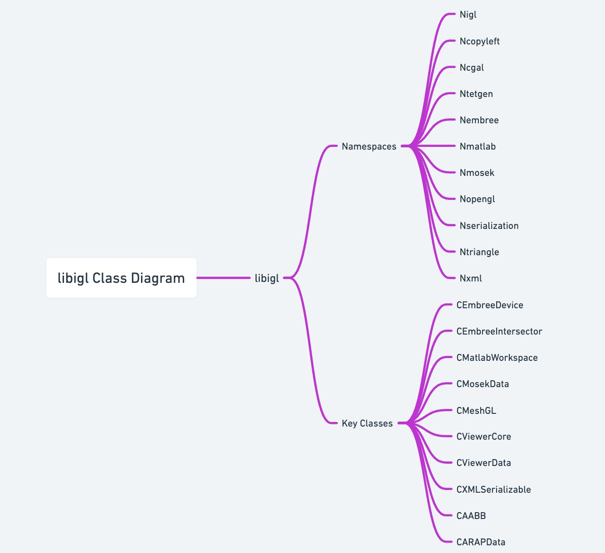
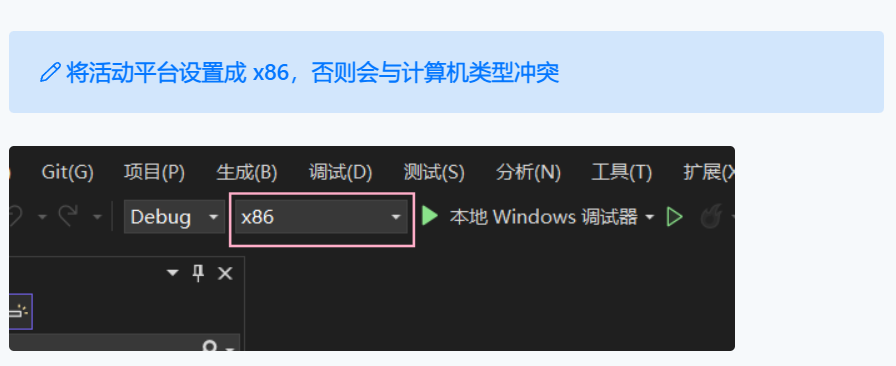
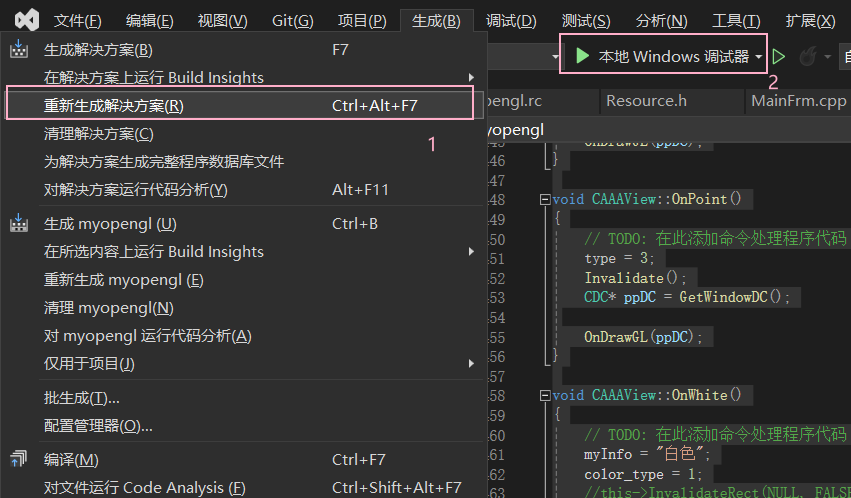
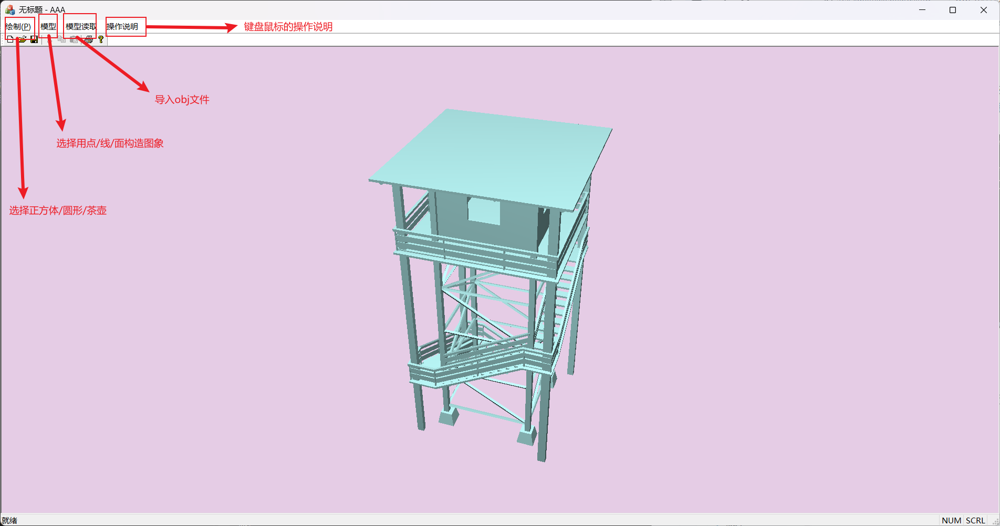

<div class="cover" style="page-break-after:always;font-family:方正公文仿宋;width:100%;height:100%;border:none;margin: 0 auto;text-align:center;">
    <div style="width:60%;margin: 0 auto;height:0;padding-bottom:10%;">
        </br>
        
    </div>
    </br></br></br></br></br>
    <div style="width:60%;margin: 0 auto;height:0;padding-bottom:40%;">
        
	</div>
    </br></br></br></br></br></br></br></br>
    <span style="font-family:华文黑体Bold;text-align:center;font-size:20pt;margin: 10pt auto;line-height:30pt;">《面向对象程序设计》</span>
    <p style="text-align:center;font-size:14pt;margin: 0 auto">大程序报告 </p>
    </br>
    </br>
    <table style="border:none;text-align:center;width:72%;font-family:仿宋;font-size:14px; margin: 0 auto;">
    <tbody style="font-family:方正公文仿宋;font-size:12pt;">
    	<tr style="font-weight:normal;"> 
    		<td style="width:20%;text-align:right;">名称</td>
    		<td style="width:2%">：</td> 
    		<td style="width:40%;font-weight:normal;border-bottom: 1px solid;text-align:center;font-family:华文仿宋">基于 OpenGL 的三维建模 </td>     </tr>
    	<tr style="font-weight:normal;"> 
    		<td style="width:20%;text-align:right;">学号</td>
    		<td style="width:2%"> </td> 
    		<td style="width:40%;font-weight:normal;border-bottom: 1px solid;text-align:center;font-family:华文仿宋">3220103784 </td>     </tr>
    	<tr style="font-weight:normal;"> 
    		<td style="width:20%;text-align:right;">授课教师</td>
    		<td style="width:2%">：</td> 
    		<td style="width:40%;font-weight:normal;border-bottom: 1px solid;text-align:center;font-family:华文仿宋"> 李际军 </td> </tr>
    	<tr style="font-weight:normal;"> 
    		<td style="width:20%;text-align:right;">日　　期</td>
    		<td style="width:2%">：</td> 
    		<td style="width:40%;font-weight:normal;border-bottom: 1px solid;text-align:center;font-family:华文仿宋">2024/1/1</td>     </tr>
    </tbody>              
    </table>
</div>


[TOC]


## 1. 大程序简介

本次大程设计为基于OpenGL图形库的三维几何建模处理软件

### 1.1 选题背景及意义

随着计算机图形学和三维建模技术的不断发展，三维几何建模处理软件在许多领域中扮演着重要角色。这些领域包括计算机辅助设计（CAD）、虚拟现实（VR）、游戏开发、工业设计等。基于OpenGL图形库的三维几何建模处理软件具有以下背景和意义：

1. 需求增加：随着科技的进步和应用领域的拓展，对于高质量、高效率的三维几何建模处理软件的需求越来越大。这样的软件可以在设计、仿真和展示等方面提供强大的支持。
2. 计算机辅助设计：在计算机辅助设计领域，三维几何建模处理软件可以帮助工程师和设计师创建和编辑复杂的三维模型，从而加快产品开发的速度和提高设计质量。
3. 虚拟现实和游戏开发：在虚拟现实和游戏开发领域，三维几何建模处理软件用于构建虚拟环境和角色模型。这些软件可以为用户提供沉浸式的视觉体验，并创造出逼真的虚拟世界。
4. 工业设计：在工业设计领域，三维几何建模处理软件用于创建产品的原型和模型。这些软件可以帮助设计师快速验证和修改设计，从而提高产品的质量和生产效率。

### 1.2 目标要求

1. 分析类体系并绘制类图：通过使用工具如Doxygen等，对代码中的类体系进行分析，理清类之间的关系，并绘制出相应的类图，以便更好地理解和组织代码结构。
2. 实现了不少于3种三维算法：项目中实现了至少3种三维算法，这些算法可能参考了该库课题组发表的论文算法，以达到特定的三维图形处理目的。
3. 三维图形显示功能：项目实现了具备放大缩小、移动旋转和真实感显示等功能的三维图形显示。这意味着用户可以对图形进行缩放、平移和旋转操作，并能够以逼真的方式显示三维图形。
4. 基于OpenGL的Visual Studio图形显示：项目在Visual Studio环境下实现了基于OpenGL的图形显示功能。这使得图形能够在Visual Studio中进行渲染和展示。
5. 数据导入导出功能：项目具备从文件中读取数据和导出数据的功能，并尽可能地采用某种标准格式。至少实现了一种文件格式（如OBJ或STL等）的数据导入导出功能，以便用户能够方便地导入和导出三维图形数据并进行显示。
6. 过程存档和调取功能：项目实现了基于类的序列化功能，支持过程的存档和调取。这意味着用户可以将必要的数据保存在快照文件中，关闭程序后再读取文件中保存的数据，以便继续之前的操作过程，实现数据的持久化和恢复。

## 2. 需求分析

### 2.1 业务需求

1. 三维建模功能：软件应该提供丰富的三维建模功能，包括创建基本几何体（如立方体、球体、圆柱体等）、合并和分割几何体、应用变换（如平移、旋转、缩放）等。用户应能够通过简单的操作创建和编辑三维模型。
2. 几何处理算法：软件应实现多种几何处理算法，如布尔运算（如并集、交集、差集）、曲线和曲面的生成与编辑、光滑和细分曲面等，以满足不同几何建模需求。
3. 真实感显示：软件应支持真实感渲染和显示技术，如光照模型、材质属性、纹理映射、阴影效果等，以使三维模型在渲染过程中更加逼真和具有艺术效果。
4. 交互式操作：软件应提供交互式的操作界面，包括鼠标和键盘交互，以便用户能够方便地进行模型的选择、移动、旋转、缩放等操作，并能够与模型进行交互。
5. 数据导入导出：软件应支持从常见的三维文件格式（如OBJ、STL、FBX等）中导入和导出模型数据，以便用户能够与其他软件进行数据交换和共享。
6. 快照和恢复：软件应支持过程的存档和调取功能，即用户可以保存当前的操作状态和数据，关闭软件后再次打开时能够恢复到之前的状态，方便用户进行工作流程的管理和继续操作。

### 2.2 功能需求

1. 三维模型创建和编辑：提供创建基本几何体（如立方体、球体、圆柱体等）的功能，并支持对现有模型进行编辑、合并和分割等操作，以实现复杂模型的构建。
2. 几何处理算法：实现多种几何处理算法，如布尔运算（如并集、交集、差集）、曲线和曲面生成与编辑、光滑和细分曲面等，以满足不同几何建模需求。
3. 交互式操作：提供交互式的用户界面，支持鼠标和键盘交互，以实现模型的选择、移动、旋转、缩放等操作，并提供实时反馈和预览功能。
4. 阴影效果：实现阴影效果，包括平面阴影和体积阴影，以增强模型的逼真程度。
5. 数据导入导出：支持从常见的三维文件格式（如OBJ等）中导入和导出模型数据，以便与其他软件进行数据交换和共享。
6. 快照和恢复：实现过程的存档和调取功能，允许用户保存当前的操作状态和数据，以便在之后的会话中恢复到之前的状态。

## 3. 新设计类功能说明

### 3.1 总体框架设计

MFC（Microsoft Foundation Classes）是微软提供的一套用于开发Windows桌面应用程序的C++类库。下面是基于MFC的总体框架设计示例：

1. 主窗口类（CMainFrame）：
   - 作为应用程序的主窗口，包含菜单栏、工具栏和状态栏等控件。
   - 创建和管理子窗口，用于显示不同的功能模块。
   - 响应用户的菜单命令和工具栏按钮点击事件。
2. 子窗口类（CChildFrame）：
   - 继承自CFrameWnd类，作为主窗口中的子窗口，用于显示不同的功能模块。
   - 创建和管理视图对象，负责显示和处理具体的内容。
3. 视图类（CView）：
   - 继承自CView类，用于处理用户界面的显示和交互。
   - 通过重写OnDraw函数实现绘图功能，将图形数据呈现在窗口上。
   - 响应用户的鼠标和键盘事件，实现交互操作。
   - 可以包含OpenGL相关的代码，实现三维建模和渲染功能。
4. 文档类（CDocument）：
   - 继承自CDocument类，负责管理应用程序的数据和文件操作。
   - 包含应用程序的状态和数据模型，可以保存和加载模型数据。
   - 提供数据的读取和写入功能，与视图类进行数据交互。
5. 应用程序类（CWinApp）：
   - 继承自CWinApp类，作为应用程序的入口点。
   - 实现应用程序的初始化和销毁过程，包括创建主窗口、注册窗口类等操作。
   - 处理应用程序级别的消息和事件，如启动、退出等。

在这个总体框架设计中，MFC提供了一系列的类和函数，用于处理窗口、消息、控件等基本的GUI操作。通过将功能模块划分为子窗口和视图，可以实现多窗口布局，并在每个窗口中显示不同的功能。视图类负责处理用户界面的显示和交互，可以包含OpenGL相关的代码，实现三维建模和渲染功能。文档类负责管理应用程序的数据和文件操作，与视图类进行数据交互。应用程序类作为应用程序的入口点，负责初始化和销毁过程，并处理应用程序级别的消息和事件。

这样的MFC总体框架设计可以提供一个基础的结构，使得开发者可以便捷地进行Windows桌面应用程序的开发，包括基于OpenGL的三维几何建模处理软件。开发者可以根据具体需求进行类的继承和函数的重写，添加自定义的功能和逻辑。

类图：



## 4. 源代码文件组织设计

```bash
.
├── AAA.cpp
├── AAA.h
├── AAADoc.cpp
├── AAADoc.h
├── AAAView.cpp
├── AAAView.h
├── ATower.obj
├── GLAUX.H
├── GLAUX.LIB
├── MainFrm.cpp
├── MainFrm.h
├── Rabbit.obj
├── enableview.cpp
├── enableview.h
├── glut.h
├── glut32.lib
├── myopengl.rc
├── myopengl.vcxproj
├── myopengl.vcxproj.filters
├── myopengl.vcxproj.user
├── res
│   ├── AAA.ico
│   ├── AAADoc.ico
│   ├── Toolbar.bmp
│   └── myopengl.rc2
├── resource.h
├── stdafx.cpp
├── stdafx.h
└── targetver.h
```

### 4.1 重点类及函数设计描述

1. EnableView 类
(1) OnSize()
原型：void OnSize(UINT nType, int cx, int cy)
功能：改变窗口大小，并同时根据需要调整景深等显示参数。
参数：nType - 大小变化的类型（最大、最小、适当变换三种类型）；cx、cy - 变化后的窗口宽度和高度。
返回值：无
局部变量：无
算法：根据窗口大小的变化重新绘制图像。

(2) OnMouseWheel()
原型：void OnMouseWheel(UINT nFlags, short zDelta, CPoint pt)
功能：响应鼠标滚轮操作，实现模型的放大或缩小。
参数：nFlags - 鼠标操作的标志；zDelta - 鼠标滚轮的滚动方向和步长；pt - 鼠标的坐标点。
返回值：无
局部变量：a - 计算放大或缩小比例的临时变量。
算法：根据鼠标滚轮的滚动方向和步长来调整模型的大小，并重新绘制图像。

(3) OnMouseMove()
原型：void OnMouseMove(UINT nFlags, CPoint point)
功能：响应鼠标移动操作，实现模型的旋转。
参数：nFlags - 鼠标操作的标志；point - 鼠标的坐标点。
返回值：无
局部变量：oldmx，oldmy - 上一次响应时鼠标的位置。
算法：根据鼠标在窗口水平方向和垂直方向上的移动距离来实现模型的左右旋转和上下旋转。通过限制上下旋转的角度，避免出现视角问题。旋转完成后重新绘制图像。

2. CAAAView 类
(1) 构造函数
原型：CAAAView()
功能：设置初始显示内容，将模型设置为正方体，将显示类型设置为线框模型。
参数：无
返回值：无
局部变量：无

(2) ordination()
原型：void ordination()
功能：绘制三个坐标轴以及坐标标识。
参数：无
局部变量：无

(6) OnReadobj()
原型：void OnReadobj()
功能：读取 obj 文件并存储，处理 obj 文件数据并绘制。
参数：无
局部变量：worldx、worldy、worldz - obj 文件的中心点，根据每个坐标轴上的最小值和最大值的和的一半计算得到。

(7) Draw_obj()
原型：void Draw_obj()
功能：根据不同的模型调用 OpenGL 函数 glVertex3f 绘制与 obj 文件对应的 3D 模型。
参数：无
局部变量：无

(8) PreTranslateMessage()
原型：void PreTranslateMessage(MSG* pMsg)
功能：重载 MFS 消息控制流，将其改为键盘响应函数。其中，WASD 控制视角的平移，EZ 控制视角的旋转，QR 实现模型的放大缩小。
参数：pMsg - 消息控制流。
返回值：无

### 5. 部署运行和使用说明

### 4.1 编译安装

环境使用 VS2022，OpenGL 的文件已经包含在文件夹里，打开工程文件，重新生成解决方案，即可运行。





### 4.2 使用操作

点击菜单栏的 “操作说明”，可以查看键盘以及滚轮的使用方法；点击模型



| 快捷键 | 效果           |
| ------ | -------------- |
| W      | 模型向上平移   |
| S      | 模型向下平移   |
| A      | 模型向左平移   |
| D      | 模型向右平移   |
| Q      | 模型放大       |
| R      | 模型缩小       |
| E      | 模型逆时针转动 |
| Z      | 模型顺时针转动 |
