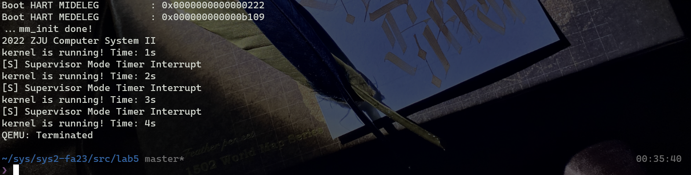
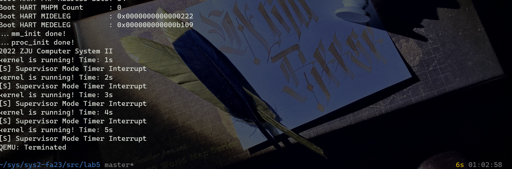

# Lab5: RV64 内核线程调度

## 实验目的

- 了解线程概念，并学习线程相关结构体，并实现线程的初始化功能
- 了解如何使用时钟中断来实现线程的调度
- 了解线程切换原理，并实现线程的切换
- 掌握简单的线程调度算法，并完成一种简单调度算法的实现

## 实验环境

- Ubuntu 22.04

### 实验步骤

### 准备工程

1. 从 lab4 和 repo 同步代码，修改 `def.h` ，确认工程可以正常运行



```
.
├── Makefile
├── arch
│   └── riscv
│       ├── Makefile
│       ├── include
│       │   ├── clock.h
│       │   ├── defs.h
│       │   ├── mm.h
│       │   ├── proc.h
│       │   └── sbi.h
│       └── kernel
│           ├── Makefile
│           ├── clock.c
│           ├── entry.S
│           ├── head.S
│           ├── mm.c
│           ├── proc.c
│           ├── sbi.c
│           ├── trap.c
│           └── vmlinux.lds
├── include
│   ├── printk.h
│   ├── rand.h
│   ├── stddef.h
│   ├── string.h
│   └── types.h
├── init
│   ├── Makefile
│   ├── main.c
│   └── test.c
└── lib
    ├── Makefile
    ├── printk.c
    ├── rand.c
    └── string.c
```

### `proc.h` 数据结构定义


### 线程调度功能实现

#### 线程初始化

```c
typedef struct task_struct * PtrToTaskStruct;
```

- 当我们的 OS run 起来时候，其本身就是一个线程 `idle 线程`，但是我们并没有为它设计好 `task_struct`。所以第一步我们要为 `idle` 设置 `task_struct`。并将 `current`, `task[0]` 都指向 `idle`。

```c
    idle = (PtrToTaskStruct)kalloc(); /* Initialize idle as first task */
    idle->state = TASK_RUNNING; /* #define TASK_RUNNING 0 为了简化实验，所有的线程都只有一种状态 */
    idle->pid = 0;
    idle->counter = 0;
    idle->priority = 0;

    task[0] = idle;
    current = idle;
```

- 为了方便起见，我们将 `task[1]` ~ `task[NR_TASKS - 1]`, 全部初始化， 这里和 `idle` 设置的区别在于要为这些线程设置 `thread_struct` 中的 `ra` 和 `sp`.

```c
    for (int i = 1; i < NR_TASKS; i++) {
        PtrToTaskStruct tasks = (PtrToTaskStruct)kalloc();
        tasks->state = TASK_RUNNING;
        tasks->pid = i;
        tasks->counter = 0;
        tasks->priority = 0;
        tasks->thread.ra = (uint64)dummy;
        tasks->thread.sp = (uint64)tasks + PGSIZE;
        task[i] = tasks;
    }
```

- 在 `_start` 适当的位置调用 `task_init`

```arm-asm/
_start:
    # MY CODE HERE
    la sp, _stack_top

    call mm_init
    call task_init
```

#### `__dummy` 与 `dummy`

- 在 `proc.c` 添加 `dummy()`
- 在 `entry.S` 添加 `__dummy`
	- 在`__dummy` 中将 sepc 设置为 `dummy()` 的地址，并使用 `sret` 从中断中返回。
	- `__dummy` 与 `_traps`的 `restore`部分相比，其实就是省略了从栈上恢复上下文的过程（但是手动设置了 `sepc`）。

```arm-asm
    .global __dummy
__dummy:
    la a0, dummy
    csrw sepc, a0
    ret
```



#### 实现线程切换

##### `switch_to()`

```c
/* 线程切换入口函数*/
void switch_to(struct task_struct* next) {
    // 1. 保存当前线程的上下文
    // 2. 将 current 指向 next
    // 3. 恢复 next 的上下文
    // 4. 返回
    if (next == current) {
        return ;
    }

    printk("\nswitch to [PID = %d PRIORITY = %d COUNTER = %d]\n", next->pid, next->priority, next->counter);
    PtrToTaskStruct prev = current;
    current = next;
    __switch_to(prev, next);

    return ;

}

```

##### `__switch_to`

```arm-asm
    .global __switch_to
__switch_to:
    # save state to prev process
    # YOUR CODE HERE
    sd ra, 40(a0)
    sd sp, 48(a0)
    sd s0, 56(a0)
    sd s1, 64(a0)
    sd s2, 72(a0)
    sd s3, 80(a0)
    sd s4, 88(a0)
    sd s5, 96(a0)
    sd s6, 104(a0)
    sd s7, 112(a0)
    sd s8, 120(a0)
    sd s9, 128(a0)
    sd s10, 136(a0)
    sd s11, 144(a0)

    # restore state from next process
    # YOUR CODE HERE 
    ld ra, 40(a1)
    ld sp, 48(a1)
    ld s0, 56(a1)
    ld s1, 64(a1)
    ld s2, 72(a1)
    ld s3, 80(a1)
    ld s4, 88(a1)
    ld s5, 96(a1)
    ld s6, 104(a1)
    ld s7, 112(a1)
    ld s8, 120(a1)
    ld s9, 128(a1)
    ld s10, 136(a1)
    ld s11, 144(a1)

    ret
```


### `schedule()`

#### 参考 [Linux v0.11 调度算法实现](https://elixir.bootlin.com/linux/0.11/source/kernel/sched.c#L122)：

1. 首先，代码通过循环遍历所有的任务（`task_struct` 结构体的指针数组），检查是否存在满足条件的任务需要唤醒。具体来说，它检查每个任务的闹钟（`alarm`）是否已经过期，如果过期，则将对应任务的信号位中的 SIGALRM 位置为1，同时将闹钟重置为0。然后，它检查是否有处于可中断状态（TASK_INTERRUPTIBLE）且收到信号的任务，如果有，则将任务的状态设置为 TASK_RUNNING，表示可以运行。
2. 接下来是调度器的核心部分。使用一个无限循环，循环条件为 `while (1)`。
    - 在每次循环开始时，初始化变量 `c` 为 -1，`next` 为 0。`c` 用于保存优先级最高的任务的计数器值，`next` 用于保存将要切换到的任务的索引。
    - 然后，通过遍历任务数组，找到优先级最高的处于运行状态（TASK_RUNNING）且计数器值最大的任务。如果找到了这样的任务，将其计数器值赋给 `c`，同时记录该任务的索引到 `next`。
    - 如果找到了满足条件的任务（`c` 不为0），则跳出循环。
    - 如果没有找到满足条件的任务（`c` 为0），则进行下一步操作。
3. 如果没有找到满足条件的任务，则进入下一轮调度。此时，需要调整所有任务的计数器值。循环遍历所有任务，将每个任务的计数器值右移一位（相当于除以2），然后加上任务的优先级。这个操作会使得计数器值较低的任务获得更多的执行机会，以平衡任务的执行。
4. 接下来，回到调度器的开头，重新开始循环，直到找到满足条件的任务。
5. 最后，调用 `switch_to` 函数，将控制权切换到下一个要执行的任务。

#### 编写我的 `schedule()` 函数：

1. 找到 counter 最小的，并且在运行的 task
2. 设置下一个进程为 counter 最小的 task
3. 如果找到了在运行的并且 counter 大于 0 的线程，切换到下一个线程，函数返回。
4. 如果没有找到 counter > 0 的线程，将所有在运行的 task 的 counter 设置成它的 priority，输出每一个 running task 的 PID，counter，priority，输出设置信息，回到 1.


### 编译运行

