## 实验准备

### 文件结构

```tree
.
├── Makefile
├── ip
│   ├── include
│   │   ├── cosim
│   │   │   ├── cj.h
│   │   │   ├── magic_device.h
│   │   │   ├── magic_type.h
│   │   │   ├── masker_enum.h
│   │   │   ├── masker_insn_fields.h
│   │   │   └── morpher.h
│   │   ├── fesvr
│   │   │   ├── byteorder.h
│   │   │   ├── config.h
│   │   │   ├── context.h
│   │   │   ├── device.h
│   │   │   ├── dtm.h
│   │   │   ├── elf.h
│   │   │   ├── elfloader.h
│   │   │   ├── htif.h
│   │   │   ├── htif_hexwriter.h
│   │   │   ├── htif_pthread.h
│   │   │   ├── memif.h
│   │   │   ├── option_parser.h
│   │   │   ├── rfb.h
│   │   │   ├── syscall.h
│   │   │   ├── term.h
│   │   │   └── tsi.h
│   │   ├── riscv
│   │   │   ├── abstract_device.h
│   │   │   ├── abstract_interrupt_controller.h
│   │   │   ├── cachesim.h
│   │   │   ├── cfg.h
│   │   │   ├── common.h
│   │   │   ├── csrs.h
│   │   │   ├── debug_module.h
│   │   │   ├── debug_rom_defines.h
│   │   │   ├── decode.h
│   │   │   ├── devices.h
│   │   │   ├── disasm.h
│   │   │   ├── encoding.h
│   │   │   ├── entropy_source.h
│   │   │   ├── extension.h
│   │   │   ├── isa_parser.h
│   │   │   ├── log_file.h
│   │   │   ├── memtracer.h
│   │   │   ├── mmio_plugin.h
│   │   │   ├── mmu.h
│   │   │   ├── platform.h
│   │   │   ├── processor.h
│   │   │   ├── rocc.h
│   │   │   ├── sim.h
│   │   │   ├── simif.h
│   │   │   ├── trap.h
│   │   │   ├── triggers.h
│   │   │   └── vector_unit.h
│   │   └── softfloat
│   │       ├── internals.h
│   │       ├── platform.h
│   │       ├── primitiveTypes.h
│   │       ├── primitives.h
│   │       ├── softfloat.h
│   │       ├── softfloat_types.h
│   │       └── specialize.h
│   └── lib
│       ├── libcontroller.a
│       ├── libcosim.a
│       ├── libdisasm.a
│       ├── libfdt.a
│       ├── libfesvr.a
│       ├── libriscv.a
│       ├── libsoftfloat.a
│       ├── libspike_dasm.a
│       └── libspike_main.a
├── sim
│   ├── Axi_lite_DDR.sv
│   ├── cosim.v
│   ├── dpi.cpp
│   └── testbench.sv
├── submit
│   ├── ALU.v
│   ├── ALUop.vh
│   ├── Axi_interface.sv
│   ├── Axi_lite_Core.sv
│   ├── Axi_lite_Displayer.sv
│   ├── Axi_lite_Hub.sv
│   ├── Axi_lite_RAM.sv
│   ├── Axi_lite_Timer.sv
│   ├── Axi_lite_Uart.sv
│   ├── BranchComp.v
│   ├── CSRModule.sv
│   ├── CSRStruct.vh
│   ├── Core.sv
│   ├── Core2MMIO_FSM.v
│   ├── Core2Mem_FSM.v
│   ├── CoreAxi_lite.sv
│   ├── Cosim_MMIO.sv
│   ├── DIsplayer.sv
│   ├── DataTrunc.v
│   ├── Decoder.v
│   ├── Define.vh
│   ├── EXEMEM.v
│   ├── ExceptReg.sv
│   ├── ExceptStruct.vh
│   ├── IDEXE.v
│   ├── IDExceptExamine.sv
│   ├── IFID.v
│   ├── ImmGen.v
│   ├── InstExamine.sv
│   ├── MEMWB.v
│   ├── MMIOStruct.vh
│   ├── MUX.v
│   ├── MaskGen.v
│   ├── MemAxi_lite.sv
│   ├── Memmap.v
│   ├── Opcodes.vh
│   ├── PipelineCPU.sv
│   ├── RAM.sv
│   ├── RaceController.v
│   ├── Racecontrol_Axi.v
│   ├── RegStruct.vh
│   ├── Regs.sv
│   ├── Timer.sv
│   ├── controller.sv
│   ├── forwarding.v
│   └── uart.sv
├── syn
│   ├── Axi_lite_DDR.sv
│   ├── Axi_lite_DDR_sim.sv
│   ├── DDR_Ctrl.sv
│   ├── DebugModule.sv
│   ├── DebugStruct.vh
│   ├── VRAM.v
│   ├── font_table.v
│   ├── io.sv
│   ├── mig.ucf
│   ├── mig_a.prj
│   ├── top.sv
│   ├── top.xdc
│   └── vram.hex
├── tcl
│   └── vivado.tcl
└── testcode
    ├── Makefile
    ├── bootload
    │   ├── Makefile
    │   ├── bootload.S
    │   ├── link.ld
    │   ├── load_binary.c
    │   └── load_binary.h
    ├── compress_elf.py
    ├── dummy
    │   └── dummy.hex
    ├── endian.py
    ├── kernel
    │   ├── Makefile
    │   ├── arch
    │   │   └── riscv
    │   │       ├── Makefile
    │   │       ├── include
    │   │       │   ├── clock.h
    │   │       │   ├── defs.h
    │   │       │   ├── mm.h
    │   │       │   ├── proc.h
    │   │       │   └── sbi.h
    │   │       └── kernel
    │   │           ├── Makefile
    │   │           ├── clock.c
    │   │           ├── entry.S
    │   │           ├── head.S
    │   │           ├── mm.c
    │   │           ├── proc.c
    │   │           ├── sbi.c
    │   │           ├── trap.c
    │   │           └── vmlinux.lds
    │   ├── include
    │   │   ├── math.h
    │   │   ├── printk.h
    │   │   ├── rand.h
    │   │   ├── stddef.h
    │   │   ├── string.h
    │   │   └── types.h
    │   ├── init
    │   │   ├── Makefile
    │   │   ├── main.c
    │   │   └── test.c
    │   └── lib
    │       ├── Makefile
    │       ├── math.c
    │       ├── printk.c
    │       ├── rand.c
    │       └── string.c
    ├── link.ld
    ├── mini_sbi
    │   ├── Makefile
    │   ├── def.h
    │   ├── mcsr.h
    │   ├── sbi_entry.S
    │   ├── sbi_head.S
    │   ├── sbi_trap.c
    │   ├── sbi_trap.h
    │   └── uart.c
    ├── rom
    │   ├── Makefile
    │   ├── link.ld
    │   └── rom.S
    └── testcase.ld

```

### 环境配置

#### 修改软件

按照实验指导和报错修改软件，去掉 `sbi_console_putchar()` 和 `sbi_console_getchar()` 避免重复定义，在 `vmlinux.lds` 中添加 `global` 变量 `_end`，在 `head.S` 中调 `ecall`

#### 安装 `riscv-unknown-elf-gcc`

```bash
sudo apt install gcc-riscv-unknown-elf
```

#### 修改 `Makefile`

将 Makefile 中的 `march=rv64i-zicsr` 改为 `march=rv64imafd`

#### 再修改 `Makefile`

挂第一条了，观察波形发现 difftest 和 dut 显示的其实是一样的，和 `rom.hex` 里的也一样。然后发现是编码问题，`/rom` 下的 Makefile 忘记改了（）

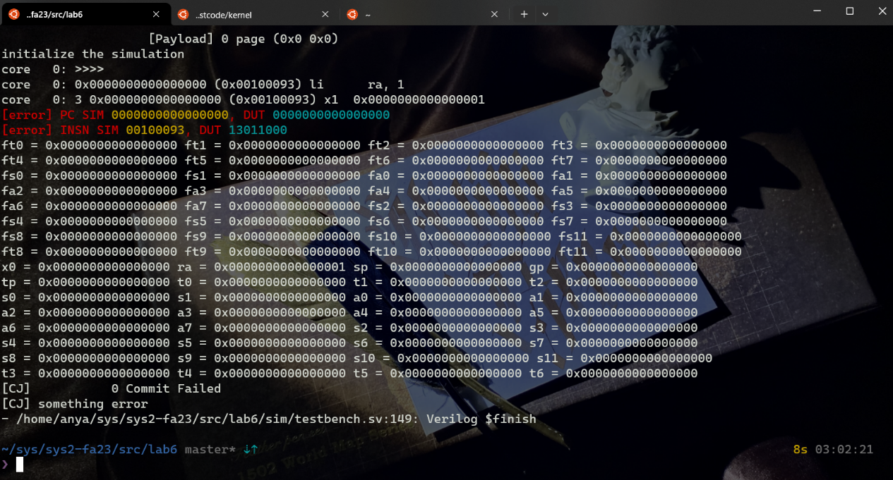

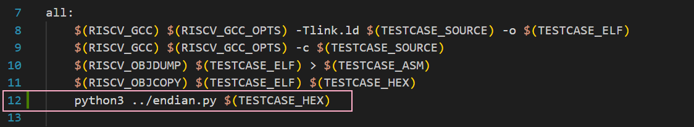

修改完就可以跑到 csr 指令所在的地方了

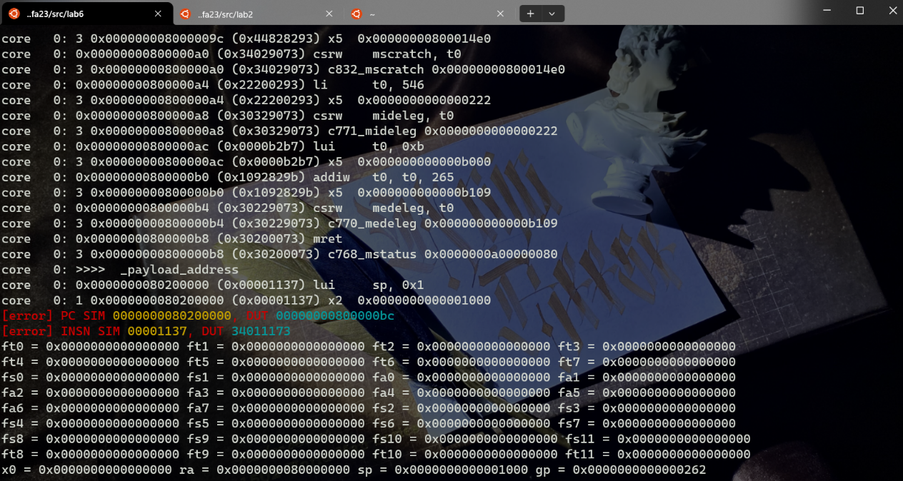

## 实验步骤

### CSR 相关指令以及 CSRModule


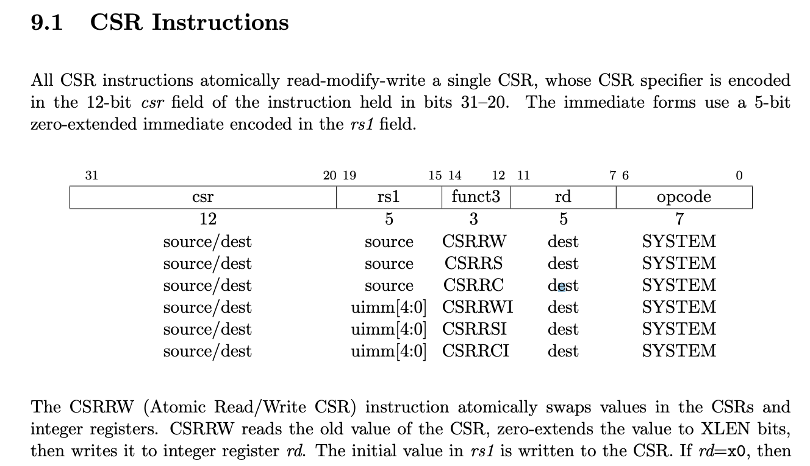
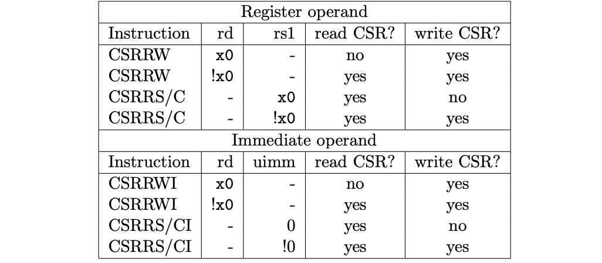
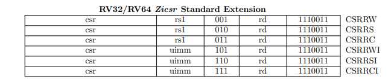
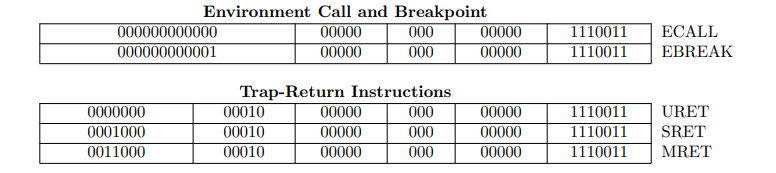

在 decoder 中添加对 csr 指令的解码 (btw 对上学期拿二进制写 decoder 的自己表示谴责。)

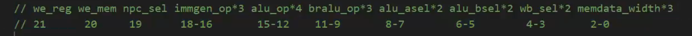

```verilog
      7'b1110011: begin
		case(inst[14:12])
			3'b000: decode = 22'b00_1000_0000_0000_0000_0000; // ecall ebreak mret sret
			3'b001: decode = 22'b10_0000_0000_0000_1000_1000; // csrrw
			3'b010: decode = 22'b10_0000_0000_0000_1000_1000; // csrrs
			3'b011: decode = 22'b10_0000_0000_0000_1000_1000; // csrrc
			3'b101: decode = 22'b10_0111_0000_0000_0100_1000; // csrrwi
			3'b110: decode = 22'b10_0111_0000_0000_0100_1000; // csrrsi
			3'b111: decode = 22'b10_0111_0000_0000_0100_1000; // csrrci
			default: decode = 22'b0;
		endcase
	  end
```

修改 regfile 和 CSRModule 里的接口，使得读写 CSR 和读写 Regs 的操作合理

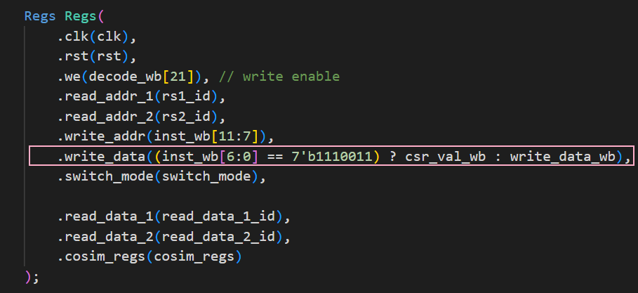

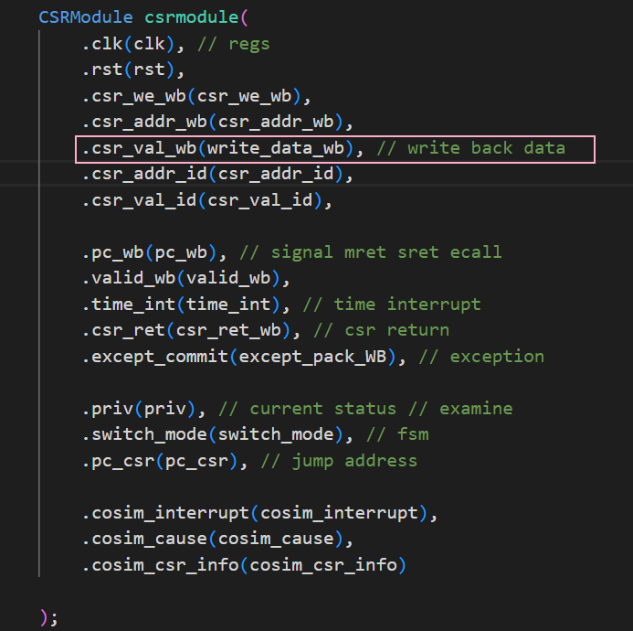

写寄存器成功

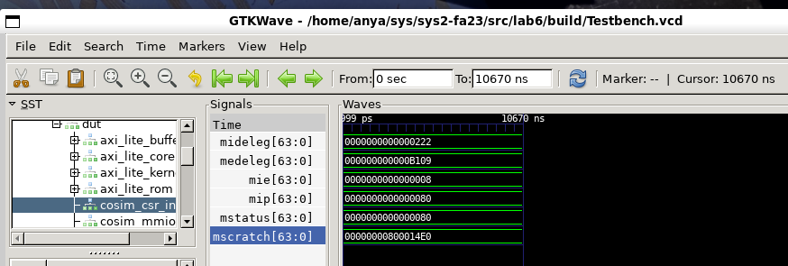

这些修改过后，可以成功运行读写 `csr` 寄存器的指令，跑到 `mret` 

查看所有的 `pc` 相关信息，发现 `csr` 相关的所有了 `pc` 值都是正确的，但是 `pc` 没有正确更新。在 `pc` 更新处加一个选择即可

```verilog
    always @(posedge clk) begin // 上升沿更新
        if (rst) pc_if_reg <= 64'b0;   // reset pc
        else if (switch_mode) pc_if_reg <= pc_csr;
        else if (~stall_PC) pc_if_reg <= npc_if; // update pc
    end

    assign pc_if = pc_if_reg;
```

### 处理异常和中断

在添加一个 `InstExceptExamine` 模块，并且把异常信息一拍一拍传下去之后，将 `WB` 阶段的异常信息传给 `CSRModule`，得到 `switchmode` 信号。

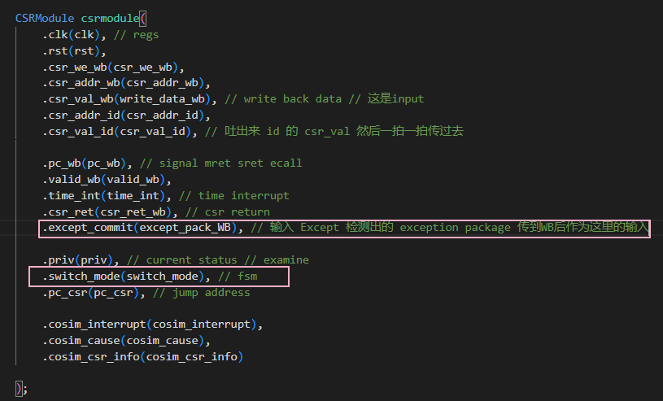

#### 修改 RaceControl

将原先的 `jump` 信号改为 `jump_new = jump | switch_mode` 即可

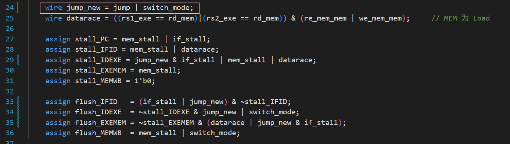

#### 修改 FSM

基本逻辑仍然没有改变：

| 起始状态 | 目标状态 | 条件 | 任务 |
| :---: | :---: | :---: | :---: |
| IDLE  | DATA  | wen_cpu \| ren_cpu (MEM请求) | mem_stall 信号和 if_stall 信号 |
| IDLE  | INST  | MEM阶段未发送请求， IF 阶段发送请求  | 发送 IF 请求信息给 CoreAxi_lite ，开启 if_stall 信号  |
| DATA  | DATA  | CoreAxi_lite 未返回 valid 信号      |  等待，保持 mem_stall 和 if_stall 信号   |
| DATA  | IDLE  | CoreAxi_lite 返回 valid 信号        |  关闭 mem_stall 信号，关闭给 CoreAxi_lite 的请求 |
| DATA  | INST  | 不会发生                         |  不会发生                     |
| INST  | INST  | CoreAxi_lite 未返回 valid 信号      |  等待，保持 if_stall 信号        |
| INST  | IDLE  | CoreAxi_lite 返回 valid 信号        |  关闭 if_stall 信号，关闭给 CoreAxi_lite 的请求 |
| INST  | DATA  | 不会发生                         |  不会发生                     |

在状态机为取指令阶段时添加一条判断，如果 `switch_mode` 信号为 1，那么多 `stall` 一拍

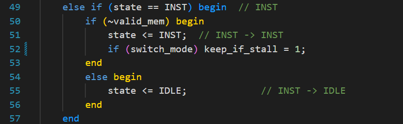

当状态为非空闲状态，并且 `if_keep_stall` 为 1 时，`if_stall`  设置成 1，Core 的 pc 不更新。

### 优化代码

把重复的接线定义成新的 wire 增强可读性，统一代码风格和位置等，修改有些寄存器的 reg/wire 类型，顺利通过综合。

### 仿真行为

#### make board sim

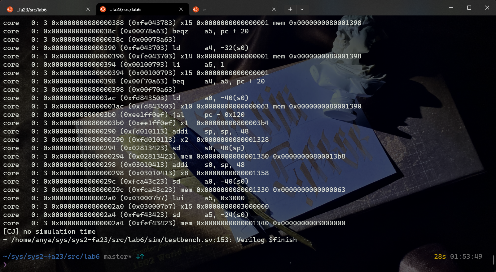

#### make 2>log

满足秒数递减和进程切换的 log

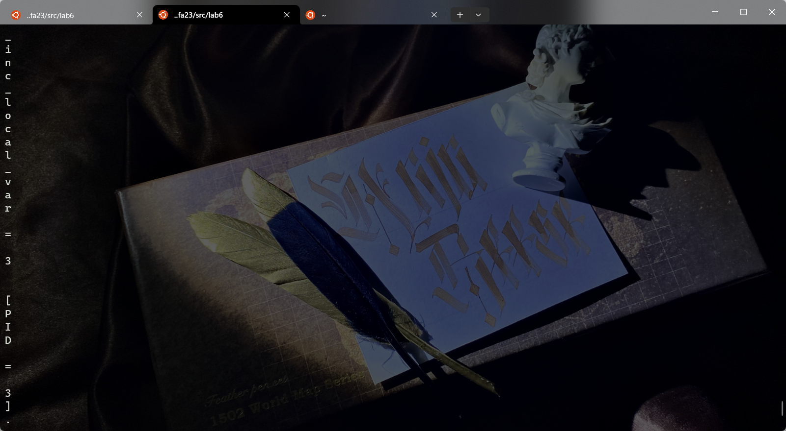

#### 上板验证

大约1s进行一次时钟中断，当 switch 7-0 的值是 01000000 的时候，LED 灯就会输出 Displayer 的移位寄存器的结果，于是我们就可以观察到 kernel 打印出来的 log，从而判断是否正确。通过验收。

## 思考题

\1. 使用 putc 函数输出一个字符 'a' 前后需要发生几次特权态切换，请将切换的状态和切换的原因一一列举出来。
	2次。
	第一次是 `ecall` 触发异常，从 S 态到 M 态，第二次调用 `sbi_console_putchar` 后 `mret` ，从 M 态到 S 态。

\2. 如果流水线的 IF、ID、MEM 阶段都检测到了异常发生，应该选择那个流水级的异常作为 trap_handler 处理的异常？请说说为什么这么选择。
	选择 MEM 阶段的指令。在我设计的 CSRCPU 中，只调用了一次异常检测模块，并且将信息一路传递到 WB 阶段，传递到 WB 阶段的指令有异常时，racecontrol 会把 IDEXE 阶段的指令 stall 住，并且 flush 掉几个阶段的指令，所以应该选择最早出现的异常。

\3. CSR 寄存器的读写操作如 csrrw、csrrwi 会不会引入新的 stall？如果会，在你的实现中引入了哪些 stall？可以用 forward 技术来减少这部分 stall 吗？
	会引入新的 stall。在我的实现中，CSRModule 和 Regsfile 是同一级关系，和 Regs 共用一个 stall。可以用 forward 技术来减少这一部分 stall，可以专门设置一个 CSRHandler，csr 这些指令并没有复杂的运算，所以没有必要和普通指令一样经过很多个 EXE 以及 MEM 的模块传到 WB。

\4. 可以为系统 II 的课改留下任何宝贵的心得体会和建议吗？（不记录分数，纯属用于吐槽）
	开学的时候最焦虑的事情就是万一 lab1 写不出来，之后所有的 lab 都会挂、、、无从下手和卡 bug 的时候也真的很焦虑和绝望，不过静下心来去理解也会发现其实没有想象中那么恐怖（还是挺恐怖的）。这么多文件真是辛苦助教了、、、
