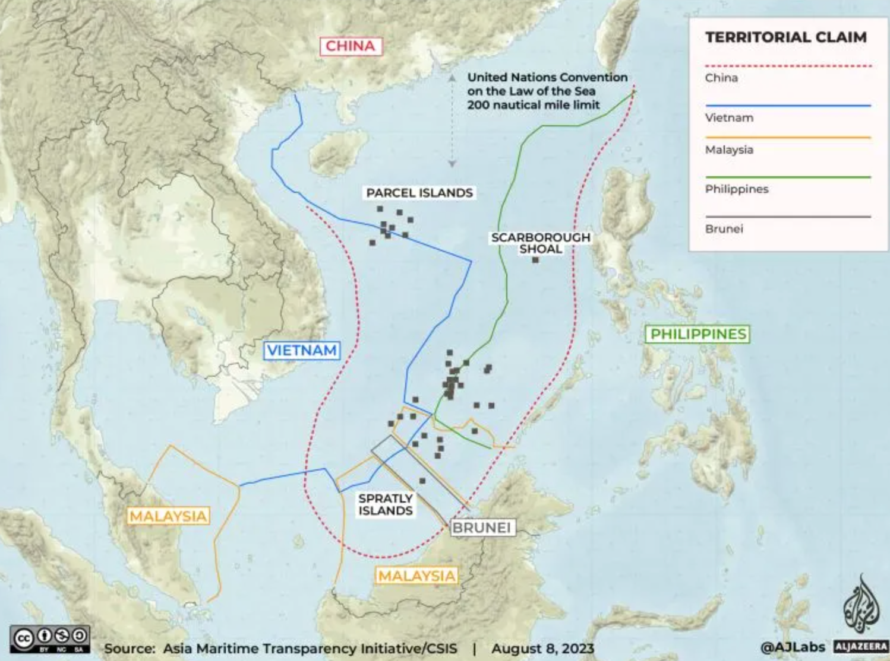

<h1>
美国“印太战略”对中国国家安全的挑战
</h1>
<h5>
林子昕 3220103784
</h5>

**摘要：** 本文以国家安全为主题，着重探讨了美国“印太战略”对中国的挑战。首先，通过文献法和历史追踪法，分析了“印太战略”的发展历程、核心要素以及在亚太地区的影响。然后，从地域和领域两个维度展开具体讨论，选择中国周边地区为重点，深入研究了中印、中俄、中日、中菲、中越等方向的国家安全问题，并通过比较法揭示了不同地区的特殊安全挑战。最后，通过理论综述，提出了国家安全体系中的安全治理、安全重心等关键要素在应对“印太战略”挑战中的理论发现和理论发展方向。

**Abstract:** This paper, centered on national security, delves into the challenges posed by the United States' "Indo-Pacific Strategy" to China. Firstly, employing literature review and historical tracing methods, it analyzes the developmental trajectory, core elements, and impact of the "Indo-Pacific Strategy" in the Asia-Pacific region. Subsequently, a detailed discussion unfolds along geographical and sectoral dimensions, with a focal point on China's neighboring regions. In-depth studies on the national security issues related to China's neighboring directions such as China-India, China-Russia, China-Japan, China-Philippines, and China-Vietnam are conducted. Comparative law is utilized to reveal distinctive security challenges in different regions. Finally, through theoretical synthesis, the paper presents theoretical findings and directions for the development of key elements in the national security framework, including security governance and security focal points, in response to the challenges posed by the "Indo-Pacific Strategy."

### 一、引言：

国家安全一直是国际政治的核心问题之一，而美国近年来推动的“印太战略”则对中国的国家安全构成了严峻挑战。本文旨在通过对“印太战略”及其对中国的影响进行深入研究，以揭示其中的地缘政治、经济、军事等层面的安全问题，并探讨国家安全体系中的理论发现和治理路径。

### 二、“印太战略”及其对中国的挑战：

#### 2. 1 “印太战略”的发展历程：

在拜登政府的“印太战略“执行过程中，美国的主要策略是通过地缘政治的构建、地缘经济的对冲以及辅助的意识形态手段来对中国实施遏制。为了在地缘政治层面平衡中国的崛起，美国采取了建立多边对话机制的方式，拉拢中国周边国家，推动“亚太北约化”与“北约亚太化”。在经济层面，美国加强了与印太国家的经济交流与合作，以对抗“一带一路”倡议，从而削弱中国在印太地区不断增强的经济影响力，同时捍卫美国的霸权利益。此外，美国还通过构建联盟体系，以意识形态和价值观为基础，对竞争对手进行负面污名化，营造中国与印太地区其他国家之间的意识形态对立，通过影响民间舆论等手段来影响中国在国际上的地位。

1. 提出阶段（20世纪初至20世纪末）：
- 演进背景： “印太战略”根植于美国长期的对亚太地区的战略关切。自20世纪初，美国在太平洋地区逐渐崛起为主要军事、经济力量，尤其在二战后成为超级大国，开始在该地区进行广泛的安全合作和经济交往。
- 核心思想： 美国在这一阶段主要关注于建立与亚太国家的联盟关系，以遏制共产主义的蔓延。其核心思想在于通过军事和政治手段，确保亚太地区保持“亲美”倾向。
- 战略目标： 美国通过加强与日本、韩国、澳大利亚等盟友的关系，确保在太平洋地区的军事存在，以维护其在该地区的霸权地位。
2. 转型阶段（1990年代至2000年代初）：
- 演进背景： 随着冷战的结束，美国重新评估其在亚太地区的战略。中国的崛起和亚洲金融危机等事件使美国认识到亚太地区的地缘政治格局发生变化，需要更加灵活的战略应对。
- 核心思想： “印太战略”开始转向注重经济合作和区域稳定。此时，美国试图通过经济和文化交流，巩固其在亚太地区的领导地位。
- 战略目标： 美国在这一阶段强调加强与东盟等地区组织的关系，推动自由贸易协定的签署，旨在通过经济手段提升在亚太地区的影响力。
3. 当代阶段（2010年代至今）：
- 演进背景： 中国的崛起、地区安全局势的变动，以及数字技术等领域的竞争加剧，促使美国重新调整其在亚太地区的战略。同时，对地缘政治竞争的强调也成为“印太战略”的重要背景。
- 核心思想： 美国的“印太战略”在当代阶段更加注重军事力量的投入，以维护其在地区的军事优势。强调遏制中国的崛起，并将地区国家纳入美国主导的安全体系。
- 战略目标： 美国通过加强与日本、澳大利亚、印度等盟友的军事合作，推动“印太战略”成为维护地区安全稳定的主导框架，同时在数字技术、网络安全等领域寻求在地缘竞争中的优势。

#### 2.2 “印太战略”对中国的影响：

1. 地缘政治角度：
- 挑战： “印太战略”旨在加强美国在印太地区的地缘政治影响力，通过强化军事联盟、塑造地区安全格局，对中国形成地缘政治的挑战。特别是通过加强与盟友的合作，形成对中国的包围态势，使其在地区事务中更加孤立。
- 影响： 中国在应对“印太战略”挑战时，需要更加灵活地处理与周边国家的关系，提升外交手段，通过多边机制参与地区事务，以保持地缘政治平衡。
2. 经济合作角度：
- 挑战： “印太战略”通过推动自由贸易协定、强化经济合作，试图在经济领域压制中国。这包括通过提出高标准贸易协定，削减对华贸易依赖，以及通过经济手段影响亚太地区的规则制定，对中国构成经济合作上的挑战。
- 影响： 中国需加强与其他地区国家的经济合作，寻求多边贸易合作的机会，推动自身参与制定地区贸易规则，以减轻“印太战略”对其经济的冲击。
3. 军事部署角度：
- 挑战： 美国通过加强军事部署、军事联盟，尤其是在“印太战略”框架下推动“QUAD”等机制，试图在军事上遏制中国的崛起。这包括加大在中国周边的军事存在，进行军事演习，对中国形成军事威慑。
- 影响： 中国需加强军事现代化，提升国防实力，以确保自身在地区军事平衡中的地位。同时，也需要通过外交手段缓解军事紧张局势，寻求与周边国家的军事合作，以维护地区稳定。
4. 潜在危机：
- 领土争端： “印太战略”加剧了一些地区的领土争端，如南海、台海等。这可能导致潜在的危机，加大地区紧张局势，对中国的周边地区和国家形成威胁。
- 军备竞赛： 随着“印太战略”推进，可能引发地区内的军备竞赛，包括导弹部署、军事基地建设等。这将加大地区的军事紧张，给中国带来潜在的军事威胁。
- 意识形态对抗： “印太战略”中的意识形态元素可能加剧地区内的意识形态对抗，对中国的意识形态安全构成挑战，导致地区内部分国家与中国的关系紧张，加大潜在危机。

### 三、中国周边地区国家安全问题的深入研究：

#### 3.1 中印边境问题：

1. 历史渊源：
1947年以前： 中印边境问题的历史渊源可以追溯到英属印度时期。英印划定的边界并不清晰，因此在印度独立后，中印边界的争议便成为一个长期存在的问题。
1950s-1960s： 中印边境问题在20世纪50年代和60年代尤为显著。西藏问题、达赖喇嘛流亡印度、中印间的争议加剧了两国之间的紧张关系。1959年，中印边界问题引发了激烈的争端，导致了1962年的中印战争。
2. 发展脉络：
1962年： 中印战争后，两国边境问题基本冻结，没有形成明确的边界线。两国在边境地区建立了一种不明确的现状，并且存在一些局部冲突。
1980s-1990s： 1988年，中印签署了“关于维护和平与宽松的边境地区的谅解”协议，缓解了边境紧张局势。然而，在争议区域，如阿克赛钦地区，依然存在争端。
21世纪初： 边境问题在21世纪初再度引发关注，特别是在2008年达赖喇嘛访问阿克赛钦地区后，中印之间的边境紧张再度升级。
3. 威胁和挑战：
军事威胁： 中印边境问题对国家安全构成军事威胁。冲突的可能性引发了军备竞赛，两国都加强了在争议地区的军事部署，升级了军事对峙。
地缘政治挑战： 边境问题导致中印之间的地缘政治竞争加剧，加大了两国在地区和国际事务中的对抗。这对两国的地缘政治战略带来挑战。
民族主义情绪： 边境争端加剧了两国之间的民族主义情绪，可能导致内外因素相互影响，加剧紧张局势。

#### 3.2 中俄战略关系：

1. 初始时期（20世纪初至20世纪50年代）：
列宁时期： 中俄关系的根基可追溯到苏联的创立。列宁时期，苏联与中国建立了初步的合作关系，尽管存在一些摩擦，但基本上保持友好合作。
2. 冷战时期（20世纪50年代至80年代）：
友好同盟： 在冷战时期，中俄建立了中苏友好同盟关系，双方合作广泛，包括政治、军事、经济等多个领域。然而，在20世纪60年代末，中苏分歧逐渐显现，关系出现裂痕。
3. 中苏分裂期（20世纪60年代末至20世纪80年代）：
意识形态对立： 中苏关系在20世纪70年代末彻底破裂，原因包括意识形态差异、领土争端等。中苏关系的冷却使得中俄战略合作一度中断。
4. 后苏联时期（20世纪90年代至2000年代初）：
改善与合作： 苏联解体后，中俄关系逐渐改善。两国在领导层高层交往和战略互信方面取得一系列进展，建立了全面的战略伙伴关系。
5. 21世纪初至印太战略时期：
战略伙伴关系： 21世纪初，中俄宣布建立全面战略协作伙伴关系。两国在军事、经济、文化等多领域展开深入合作，形成战略合作的格局。
6. 印太战略时期（2010年代至今）：
战略协作深化： 随着“印太战略”的提出，中俄关系得到进一步深化。两国在国际事务中相互支持，共同维护地区和全球安全，共同抵制外部压力。
7. 演变背后的动力：
地缘政治因素： 中俄在地缘政治上有共同关切，对抗外部威胁，维护地区稳定成为两国合作的重要动力。
经济合作： 两国在经济上互补性强，相互投资和贸易合作增强了双方的战略依存关系。
印太战略的冲击： “印太战略”导致地区局势复杂化，中俄加强合作以维护共同利益。

#### 3.3 南海争端：

1. 起源阶段（20世纪初至20世纪40年代）：
领土主张： 南海争端的根源可以追溯到20世纪初，当时中国开始对南海诸岛提出领土主张，这引发了与周边国家的领土争端。
2. 第二次世界大战时期（1940年代）：
战争对南海的影响： 日本占领南海诸岛期间，南海的地缘政治格局发生变化，一些岛屿的控制权在战后成为争端的焦点。
3. 冷战时期（1950年代至1980年代）：
地缘政治演变： 冷战时期，南海争端受到冷战格局的影响，一些国家在南海展开竞争，地区稳定受到威胁。
4. 争端激化阶段（1990年代至今）：
领土主张与资源争夺： 争端在1990年代激化，南海的领土争端逐渐演变为涉及资源分配、渔业权益等更为复杂的问题；国际仲裁与裁决： 中国与菲律宾、越南等国就南海争端问题进行国际仲裁，但裁决结果引发争议，未解决争端。

5. 对中国海洋安全的影响：
战略威胁： 南海争端使中国面临战略威胁，涉及到国家的领土完整和海洋权益；海上安全环境： 争端导致南海地区的安全环境复杂化，海上活动容易受到地缘政治因素的干扰。
6. 国际因素的影响：
地区国际角力： 南海争端受到国际因素的影响，不仅涉及周边国家，还引起国际大国在南海的角力；国际舆论压力： 国际社会对南海争端的关注和舆论压力使得解决争端变得更为复杂。
7. 未来走向与应对策略：
多边合作机制： 提倡建立多边合作机制，通过对话与谈判解决争端，促进地区和平与稳定。
国际法治理： 强调依据国际法解决南海争端，通过法治方式推动解决方案的可持续性。

### 四、国家安全体系中的理论发现与治理路径：

#### 4.1 安全重心：

国家安全体系中安全重心的转变是一个复杂而关键的问题，特别是在“印太战略”时代，中国需要审时度势，调整其安全重心策略。本文通过理论综述，分析国家安全体系中安全重心的演变趋势，探讨在当前国际格局下中国应如何应对。
1. 安全重心的历史演变：
传统威胁到非传统威胁： 在冷战时期，安全重心主要集中在传统军事威胁上。然而，随着全球化和科技的发展，非传统威胁，如经济、网络和环境问题，逐渐成为国家安全的重要组成部分。
2. 当前国际形势下的安全挑战：
印太战略的崛起： 美国通过推动“印太战略”在亚太地区加强军事存在，对中国构成潜在威胁。地缘政治竞争和军事对抗成为当前安全环境的主要特征。
非传统威胁的崛起： 同时，中国还面临着网络安全、气候变化、能源安全等非传统威胁，这些威胁已经超越了传统的领土争端。
3. 安全重心的调整策略：
全面国家安全观： 倡导全面国家安全观，强调传统和非传统威胁的统一，实现军事、政治、经济、文化、社会等多领域的协同发展。
战略自主性： 提升国家战略自主性，摆脱对外部因素的过度依赖，通过自主创新和技术升级提升国家核心竞争力。
多边合作： 通过多边合作机制，积极参与全球治理，共同应对全球性挑战，促进国际社会的共赢。
4. 应对“印太战略”的战略调整：
外交缓和与平衡： 通过外交手段缓和与印太国家的紧张关系，寻求地区和解，建立互信机制，平衡力量对抗。
经济安全优先： 将经济安全置于战略核心位置，加强自主创新、提高产业链自主可控能力，维护国家长期繁荣和稳定。
军事现代化： 推进军事现代化，提高军事实力和战略威慑力，确保国家安全。

### 五、结论：

在“印太战略”框架下，美国试图打破亚太地区现有的政治、经济、安全合作，削弱以东盟为核心的地区合作架构，推动以美国为主导的霸权体系。其强调“五眼联盟”、推动“四边机制”和美英澳三边安全伙伴关系，以及美日韩、美日菲三边合作机制，旨在通过意识形态划分阵营、挑起对抗，实现地区国家的选边站队。美国声称建立“自由和开放印太地区”，却实际上在逼迫地区国家加入其封闭排他的小圈子，制造大国对立和阵营对抗，破坏亚太地区的和平稳定、经贸合作和一体化进程。这一霸权行径引起国际和亚太国家的普遍警惕和担忧，地区国家普遍认为美国的目的是为了服务自身利益，制造分裂和对抗只会导致混乱和不稳定。亚太地区应该是和平发展的高地，而不是地缘博弈的棋局。合作应符合地区国家的共同利益，规则秩序应由地区国家共同决定，而不是由个别国家单边发号施令。美国持续沿用20世纪的冷战思维和霸权逻辑，推动“印太战略”的做法违背了地区国家人民的普遍意愿，注定会失败。中国在面对“印太战略”挑战时，主张和平发展、多边主义，强调合作共赢，通过深化地区合作、加强自身国防能力建设等多方面的努力，维护国家安全和地区稳定。

**关键词：** 国家安全、印太战略、地缘政治、安全治理、安全重心

\[1]: 赵祺、罗圣荣.拜登政府“印太战略”的集团化研究：基于小多边主义理论视角J.东北亚论坛.2023(02).
\[2]: 新华时评：美国“印太战略”只会让地区不太平 新华社北京 2023 10月7日
\[3]: 吴兆礼：印太战略的发展、局限及中国应对 2020(05)
\[4]: 金永明,于小雨.日本的“印太战略”:形成、动因及收益分析2023.11.24
\[5]: 韦宗友等：复旦大学国际关系研究学院《印太战略视角下的拜登政府南海政策：权力、规则与秩序》2023.5.1
\[6]: 崔進揆: 拜登政府印太戰略：論述的演進與政策實踐 2023

### 论文体会：

 在论文撰写的过程中，我深刻体会到军事和政治是一个需要综合考虑的复杂话题。若平时未曾特别关注这些方面，可能对各层面的内在联系缺乏足够的敏感度，因此前期在查阅文献和相关历史事件时花费了相当多的时间。然而，通过在文献中建立一个初步框架，并按照一定问题的线索深入了解更多内容，最终我成功地使东北亚地区的关系有了相对清晰的认识。同时，我也发现自己平时对这方面的关注较为有限，真正深入了解后才意识到当前形势已经十分紧张。这给了我一个警示，积极了解国家的意识是非常重要的，提示我今后需要更加关注国际形势的变化，以更好地了解和应对未来的挑战。

